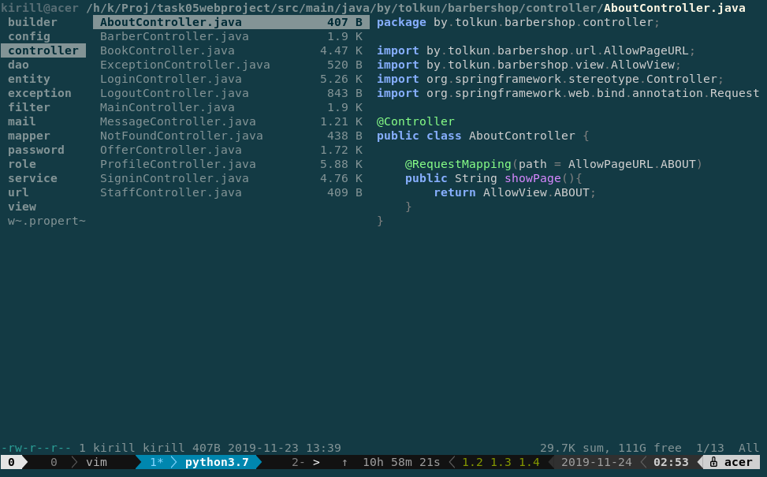
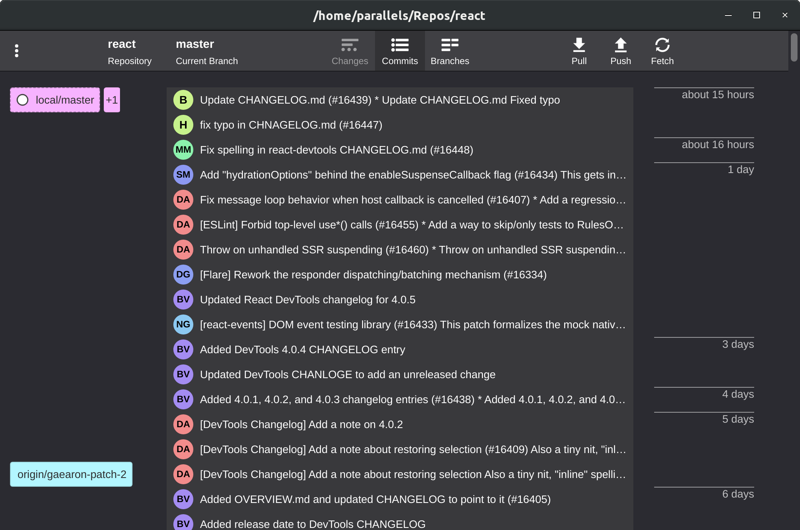
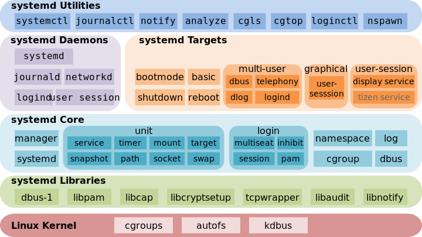

<!-- vim-markdown-toc GFM -->

* [Installing extensions in GNOME](#installing-extensions-in-gnome)
* [Installing packages](#installing-packages)
	* [Installing and setup of system](#installing-and-setup-of-system)
		* [Installing and setup packages](#installing-and-setup-packages)
			* [1. Setup _sudo_:](#1-setup-_sudo_)
			* [2. Installing drivers:](#2-installing-drivers)
			* [3. Installing main tools:](#3-installing-main-tools)
			* [4. Installing applications and adding utils:](#4-installing-applications-and-adding-utils)
	* [Xbacklight](#xbacklight)
	* [Amixer](#amixer)
	* [Playerctl](#playerctl)
	* [Xclip](#xclip)
		* [Xclip man page](#xclip-man-page)
		* [Using xclip](#using-xclip)
		* [Clipboard to image](#clipboard-to-image)
		* [Python script to copy](#python-script-to-copy)
	* [Xsel](#xsel)
		* [Xsel man page](#xsel-man-page)
		* [Using xsel](#using-xsel)
	* [Fzf](#fzf)
	* [Ag](#ag)
	* [Ripgrip](#ripgrip)
	* [Bat](#bat)
	* [Java](#java)
		* [Using different versions of binary jdk files](#using-different-versions-of-binary-jdk-files)
	* [Maven](#maven)
	* [Powerline](#powerline)
		* [Fonts in powerline](#fonts-in-powerline)
	* [Ueberzug](#ueberzug)
	* [Figlet](#figlet)
		* [Using figlet](#using-figlet)
	* [Dmenu](#dmenu)
		* [Using dmenu](#using-dmenu)
	* [Clipmenu](#clipmenu)
		* [Configuring clipmenu](#configuring-clipmenu)
		* [Using clipmenu](#using-clipmenu)
		* [Notes clipmenu](#notes-clipmenu)
	* [Clipster](#clipster)
	* [Dunst](#dunst)
		* [Installing dunst](#installing-dunst)
		* [Libnotify-bin](#libnotify-bin)
			* [Installing libnotify-bin](#installing-libnotify-bin)
			* [Send-nofify man page](#send-nofify-man-page)
			* [Using libnotify-bin](#using-libnotify-bin)
		* [Dunstify](#dunstify)
			* [Installing dunstify](#installing-dunstify)
			* [Dunstify man page](#dunstify-man-page)
			* [Using dunstify](#using-dunstify)
		* [Configuring dunst](#configuring-dunst)
		* [Using dunst](#using-dunst)
	* [Urxvt](#urxvt)
			* [Urxvt config](#urxvt-config)
			* [Urxvt plugins](#urxvt-plugins)
	* [Snap](#snap)
		* [Command in Snap](#command-in-snap)
		* [Notes Snap](#notes-snap)
	* [I3WM](#i3wm)
		* [Using I3WM](#using-i3wm)
			* [Fonts in I3WM](#fonts-in-i3wm)
		* [Configuring I3WM](#configuring-i3wm)
			* [Initializing variables](#initializing-variables)
				* [Add default dirs with `.desktop` files](#add-default-dirs-with-desktop-files)
				* [Configuring `Snap` in `I3WM`](#configuring-snap-in-i3wm)
	* [Zsh](#zsh)
		* [Plugins in Zsh](#plugins-in-zsh)
			* [Zsh-syntax-highlighting](#zsh-syntax-highlighting)
			* [Zsh-autosuggestions](#zsh-autosuggestions)
		* [Powerline in Zsh](#powerline-in-zsh)
			* [Fonts in Powerline](#fonts-in-powerline-1)
		* [Fuzzy finder in Zsh](#fuzzy-finder-in-zsh)
			* [Files preview in `fzf` in Zsh](#files-preview-in-fzf-in-zsh)
			* [Additional `functions` in `fzf` in Zsh](#additional-functions-in-fzf-in-zsh)
			* [Addtional `hotkeys` in `fzf` in Zsh](#addtional-hotkeys-in-fzf-in-zsh)
		* [Clipboard to image in Zsh](#clipboard-to-image-in-zsh)
	* [Tmux](#tmux)
		* [Hotkeys](#hotkeys)
			* [Managing sessions](#managing-sessions)
			* [Managing windows](#managing-windows)
			* [Managing split panes](#managing-split-panes)
				* [Creating a new pane by splitting an existing one](#creating-a-new-pane-by-splitting-an-existing-one)
				* [Switching between panes](#switching-between-panes)
				* [Moving panes around](#moving-panes-around)
				* [Resizing panes](#resizing-panes)
				* [Other](#other)
		* [Commands](#commands)
	* [Ranger](#ranger)
		* [Archives preview in Ranger](#archives-preview-in-ranger)
		* [Fuzzy finder in Ranger](#fuzzy-finder-in-ranger)
		* [Ag in Ranger](#ag-in-ranger)
		* [Clipboard to image in Ranger](#clipboard-to-image-in-ranger)
		* [Highlighting of syntax in file preview](#highlighting-of-syntax-in-file-preview)
	* [GitFiend](#gitfiend)
	* [Telegram](#telegram)
	* [Discord](#discord)
	* [Mathpix snipping tool](#mathpix-snipping-tool)
	* [Postman](#postman)
	* [Krita](#krita)
	* [Vim](#vim)
		* [Initial config](#initial-config)
		* [Vundle](#vundle)
		* [Vim Plug](#vim-plug)
		* [Theme in vim](#theme-in-vim)
		* [Markdown in vim](#markdown-in-vim)
			* [Hotkeys](#hotkeys-1)
		* [Latex in vim](#latex-in-vim)
			* [Vimtex](#vimtex)
				* [Hotkeys](#hotkeys-2)
		* [UltiSnips](#ultisnips)
		* [NERDTree](#nerdtree)
		* [Fzf vim plugin](#fzf-vim-plugin)
			* [Commands](#commands-1)
* [Learning](#learning)
	* [Environment variables](#environment-variables)
		* [Common info](#common-info)
		* [Set value to variable](#set-value-to-variable)
		* [Remove dublicates](#remove-dublicates)
	* [Clipboard](#clipboard)
		* [Clipboard common info](#clipboard-common-info)
		* [Clipboard MIME TYPES](#clipboard-mime-types)
		* [Clipboard tools](#clipboard-tools)
	* [Systemd](#systemd)
		* [Architecture systemd](#architecture-systemd)
		* [Features systemd](#features-systemd)
		* [Using systemd](#using-systemd)
			* [Common commands systemd](#common-commands-systemd)
			* [Common commans journalctl](#common-commans-journalctl)
			* [Unit commands systemd](#unit-commands-systemd)
			* [Power command systemd](#power-command-systemd)
		* [Create custom unit for systemd](#create-custom-unit-for-systemd)
			* [Create custom service unit for systemd](#create-custom-service-unit-for-systemd)
				* [Service type](#service-type)
				* [Rules to create service for systemd](#rules-to-create-service-for-systemd)
					* [[Unit] section](#unit-section)
					* [[Service] section](#service-section)
					* [[Install] section](#install-section)
				* [Manage custom service in systemd](#manage-custom-service-in-systemd)
		* [Examples of custom units](#examples-of-custom-units)
		* [Notes for creating custom units](#notes-for-creating-custom-units)
		* [Useful links](#useful-links)
	* [Network Managment](#network-managment)
		* [Eduroam](#eduroam)
	* [TeX](#tex)
		* [Pgfplots](#pgfplots)
* [Solving problems](#solving-problems)
	* [Defect in TTY](#defect-in-tty)

<!-- vim-markdown-toc -->
 
lspci | grep "NVIDIA" | cut -b -8		Найти порт, к которому подключена видеокарта
lspci -v					Показать всю инфу оборудования sudo dpkg -s
tlp Проверить есть ли пакет tlp
sudo /etc/init.d/tlp restart			Перезагрузка сервиса tlp
sudo /etc/init.d/cpufreqd restart		Перезагрузка сервиса cpufreqd
sudo service bumblebeed restart			Перезагрузка bumblebee

Изменить файл tlp: sudo gedit /etc/default/tlp

sudo apt -f install				Решение проблем с пакетами
sudo apt-get dist-upgrade			Решение проблем с пакетами

sudo gedit  /etc/apt/sources.list
```
СИСТЕМА: ```sh
systemctl hibernate				Гибернация
systemctl suspend				Сон

update-alternatives --config java		Обновить переменную java
pkill -KILL  -u  { имя пользователя }		Убить все процессы пользователя
sync; echo 3 > /proc/sys/vm/drop_caches		Очистить все возможные типы памяти
sudo cat /sys/kernel/debug/vgaswitcheroo/switch Посмотреть включённые видеокарты
```

Настройки
```sh
	gsettings set org.gnome.shell.extensions.auto-move-windows
	application-list "['APPLICATION.desktop: WORKSPACE']"
	gsettings set org.gnome.shell.extensions.auto-move-windows
	application-list "[
		'telegramdesktop.desktop: 4',
		'vk.desktop:4',
		'firefox-esr.desktop:1',
		'google-chrome.desktop:1',
		'org.gnome.Terminal.desktop:2',
		'org.gnome.gedit.desktop:3',
		'jetbrains-idea.desktop:5',
		'skypeforlinux.desktop:4',
		'discord.desktop:4',
		'org.gnome.Documents.desktop:3',
		'org.gnome.tweaks.desktop:9', 'synaptic.desktop:9',
		'org.gnome.Evolution.desktop:4'
	]"
```
# Installing extensions in GNOME

1. Выпадающий терминал https://extensions.gnome.org/extension/442/drop-down-terminal/
2. Тайлинговый менеджер https://extensions.gnome.org/extension/1268/gnomesome/
3. Запуск приложений на заданом раб. столе https://extensions.gnome.org/extension/16/auto-move-windows/
4. Рисование на экране https://extensions.gnome.org/extension/1683/draw-on-you-screen/
5. Удаление стрелочек на dockpanel https://extensions.gnome.org/extension/800/remove-dropdown-arrows/
6. Уменьшение отступов в dockpanel https://extensions.gnome.org/extension/355/status-area-horizontal-spacing/
7. Иконки трея в dockpanel https://extensions.gnome.org/extension/1503/tray-icons/
8. Индикатор активном рабочего стола в dockpanel https://extensions.gnome.org/extension/21/workspace-indicator/H
9. Контейнер копированный элементов https://extensions.gnome.org/extension/779/clipboard-indicator/
10. Онлайн переводчик (надо устанавл. пакет translate-shell) https://extensions.gnome.org/extension/1756/text-translator/ 

DOCKER:
```sh
docker run -it <image_name> Запуск контейнера на основе образа в интерактивном режиме
docker run -d <image_name> Запуск контейнера на основе образа в фоновом режиме
docker run -p 8000:8080 <image_name> Запуск контейнера на основе образа с пробрасыванием порта (порт на машине:порт в контейнере)
Пример docker run -d -p 8000:8080 bitnami/apache => перейти localhost:8000 => "It works!"  - запуск apache в фоновом режиме (-d) с пробрасыванием порта (-p)
docker commit <container_name> <user_name>/<image_name> Создать образ с именем <image_name> из контейнера <container_name> под пользователем <user_name> docker
ps -aq -f status=exited					 Список всех (id) остановленных контейнеров docker
build -t <user_name>/<image_name> .			 Строит образ по докер-файлы при запуске данной команды из папки с докер-файлом
```
DOCKER-COMPOSE:
```sh
docker-compose rm -v $(docker-compose images -q --filter status=exited) Удалить все образы

После установки _docker_ в сервисы `docker.service`, `containerd.service` и сокет `docker.socket` автоматически запускаются во время загрузки операционной системы, т.е. имеют 
```

Блинов:
	1) стр. 533


/usr/local/lib/python2.7/dist-packages/powerline/


Расширения для gnome-shell находятся в
папках:
	* usr/share/gnome-shell/extensions/ *
	~/.local/share/gnome-shell/extensions/

# Installing packages
 
## Installing and setup of system
В конце установки _Debian_ снимаем галки со всех пунктов (различных окружений рабочего стола, сервера печати и т.п.), оставляем только "Стандартные системные утилиты". Это делается для того, чтобы не устанавливались лишние пакеты, т.к., например, вместо окружений рабочего стола будет использовать менеджер окон [i3wm](#i3wm).

### Installing and setup packages
#### 1. Setup _sudo_:
```sh
# Авторизация в качестве суперпользователя, сразу после включения
# c логином root и паролем заданным для суперпользователя во время
# установки
root

# Установка пакета sudo
apt install sudo

# Добавление обычного пользователя в группу sudo, чтобы он мог
# выполнять команды от имени суперпользователя, используя команду
# sudo, где name_of_user - имя обычного пользователя
usermod -aG sudo name_of_user

# Завершение сессии суперпользователя
exit
```

#### 2. Installing drivers:
Сразу добавим в список используемых репозиториев репозитории с несвободным ПО. Для этого в файл `/etc/apt/source.list` заменим строки с обычными репозиториями на несвобоные:

```sh
# Открыли файл source.list в текстовом редакторе vi
vi /etc/apt/source.list

# Добавляем к похожим строками слова "contrib non-free"
deb http://deb.debian.org/debian/ buster main
deb-src http://deb.debian.org/debian/ buster main

# Получаем следующие строки
deb http://deb.debian.org/debian/ buster main contrib non-free
deb-src http://deb.debian.org/debian/ buster main contrib non-free

# Сохраняем файл и выходим (:wq)
```

Чтобы понять, каких драйверов не хватает, следует выполнить команду `sudo dmesg -l err` и посмотреть на ошибки. По ошибками становиться понятно, какие устройства не определились.

Устанавливаем драйвера:

```sh
# Установки всех основных драйверов, необходима всем
sudo apt install firmware linux

# Установка драйверов для устройств atheros (ставим по необходимости)
sudo apt install firmware-atheros

# Установка драйверов для устройств realtek (ставим по необходимости)
sudo apt install firmware-realtek

# Установка инструментов для энергосбережения (для ноутбуков).
# Работает автоматически, можно редактировать конфиги
sudo apt install laptop-mode-tools

# Установка инструментов для работы с двумя видеокартами (встроенной и дискретной).
# Для правильной работы, необходимо отключить "Secure Mode" в bios.
# Для запуска приложений `optirun app_name` или `primusrun app_name`
# (primus более оптимизирован)
sudo apt-get install bumblebee-nvidia primus libgl1-nvidia-glx

# Утилита для управления интернет подключениями (nmcli, nmtui)
sudo apt install network-manager
```

#### 3. Installing main tools:

```sh
sudo apt install curl
# Пакета для добавление новых репозиториев командой add-apt-repository
sudo apt install software-properties-common
sudo apt install xsel
sudo apt install xclip
sudo apt install fonts-freefont-ttf
sudo apt install unzip
sudo apt install unrar
# Для работы mount с файловой системой ntfs
sudo apt install ntfs-3d

sudo apt install git
sudo apt install python
sudo apt install python-pip
sudo apt install python3-pip

sudo mkdir /usr/local/oracle-java-8/
sudo tar -zxf oracle-java-8.tar.gz -C /usr/local/oracle-java-8/
sudo update-alternatives --install "/usr/bin/java" "java" "/usr/local/oracle-java-8/jdk1.8.0_241/bin/java" 1
sudo update-alternatives --install "/usr/bin/javac" "javac" "/usr/local/oracle-java-8/jdk1.8.0_241/bin/javac" 1
sudo update-alternatives --install "/usr/bin/javaws" "javaws" "/usr/local/oracle-java-8/jdk1.8.0_241/bin/javaws" 1
sudo update-alternatives --install "/usr/bin/jar" "jar" "/usr/local/oracle-java-8/jdk1.8.0_241/bin/jar" 1

sudo mkdir /usr/local/oracle-java-11/
sudo tar -zxf oracle-java-11.tar.gz -C /usr/local/oracle-java-11/
sudo update-alternatives --install "/usr/bin/java" "java" "/usr/local/oracle-java-11/jdk-11.0.6/bin/java" 2
sudo update-alternatives --install "/usr/bin/javac" "javac" "/usr/local/oracle-java-11/jdk-11.0.6/bin/javac" 2
# Такую команду не выполняем, т.к. javaws нет в составе jdk-11
# sudo update-alternatives --install "/usr/bin/javaws" "javaws" "/usr/local/oracle-java-11/jdk-11.0.6/bin/javaws" 2
sudo update-alternatives --install "/usr/bin/jar" "jar" "/usr/local/oracle-java-11/jdk-11.0.6/bin/jar" 2

sudo apt install docker
sudo apt install docker-compose
# Пакет для работы с символическими ссылками (бэкап и восстановление 
# символических ссылок на конфигурационные файлы
sudo apt install stow

#	 __     __  ___   __  __ 
#	 \ \   / / |_ _| |  \/  |
#	  \ \ / /   | |  | |\/| |
#	   \ V /    | |  | |  | |
#	    \_/    |___| |_|  |_|
#	                         

# Установка текстового редактора vim
sudo apt install vim-gtk3
	# Установка менеджера пакетов python для установки powerline
	sudo apt install python-pip
	# Установка пакета powerline
	pip install --user git+git://github.com/powerline/powerline
		# Клонирование репозитория со шрифтами
		git clone https://github.com/powerline/fonts.git
		# Переход в склонированную директорию
		cd fonts
		# Установка шрифтов для powerline
		./install.sh
		# Обновление индекса шрифтов
		sudo fc-cache -f -v
		# Удаление оставшихся файлов
		cd ..
		rm -rf fonts

	# Установка утилиты для поиска ag для плагина vim "fzf-vim"
	sudo apt install silversearcher-ag
	# Установка утилиты для поиска ripgrep для плагина vim "fzf-vim"
	sudo apt install ripgrep
	# Установка утилиты для поиска fzf для плагина vim "fzf-vim"
	sudo apt install fzf

	# Установка latexmk компиляции pdf из tex
	sudo apt install latexmk
	# Установка zathura для открытия pdf-файлов
	sudo apt install zathura
	# Установка xdotool для поиска по pdf-файлу из vim
	sudo apt install xdotool

	# Восстановление конфигураций vim
	cd ~/.dotfiles
	stow -vRt ~ vim

#	 __  __   ___    ____     ____ 
#	 \ \/ /  / _ \  |  _ \   / ___|
#	  \  /  | | | | | |_) | | |  _ 
#	  /  \  | |_| | |  _ <  | |_| |
#	 /_/\_\  \___/  |_| \_\  \____|
#	                               
# Установка графического сервера xorg (X11)
sudo apt install xorg
	cd ~/.dotfiles
	sudo stow -vRt / xorg

#	  ___   _____  __        __  __  __ 
#	 |_ _| |___ /  \ \      / / |  \/  |
#	  | |    |_ \   \ \ /\ / /  | |\/| |
#	  | |   ___) |   \ V  V /   | |  | |
#	 |___| |____/     \_/\_/    |_|  |_|
#	                                    
# Установка менеджера оконо i3wm
sudo apt install i3
	# Установка xbacklight для регулировки яркости экрана (хоткеи в конфиге)
	sudo apt install xbacklight

	# Установка playerctl для управления воспроизведением медиа-файлова
	# (хоткеи в конфиге)
	sudo apt install playerctl

	# Установка amixer (alsa-utils) для регулировки громкости динакиков/микрофона
	# (хоткеи в конфиге)
	sudo apt install alsa-utils
	sudo apt install pulseaudio
	# Установка dbus-launch (dbus-x11). Необходимо, чтобы при запуске xorg
	# вызывалась команда dbus-launch (реализовано в .xinitrc)
	sudo apt install dbus-x11

	# Установка hsetroot для установки обоев рабочего стола
	sudo apt install hsetroot

	# Установка libnotify-bin для отправки уведомлений серверу dunst
	sudo apt install libnotify-bin
	cd ~/.cscripts
	# Создание символической ссылки в /usr/local/bin на dunstify
	sudo stow -vRt / dunstify
	# Восстановление конфигураций dunst
	cd ~/.dotfiles
	stow -vRt ~ dunst

	# Создание символических ссылок в /usr/local/bin на clipmenud, clipmenu,
	# clipdel, clipnotify
	cd ~/.cscripts
	sudo stow -vRt / clipmenu

	# Установка инструмента для создания скриншотов
	sudo apt install scrot

	# Установка инструмента для получение координат и размеров 
	# выделенной области (будет использоваться для scrot)
	sudo apt install slop

	# Установка лаунчера приложений rofi 
	sudo apt install rofi

	# Переходим в директорию с конфигурациями
	cd ~/.dotfiles
	# Восстановление конфигураций i3
	stow -vRt ~ i3
	# Восстановление конфигураций i3status
	stow -vRt ~ i3status

#	  _   _   ____   __  __ __     __  _____ 
#	 | | | | |  _ \  \ \/ / \ \   / / |_   _|
#	 | | | | | |_) |  \  /   \ \ / /    | |  
#	 | |_| | |  _ <   /  \    \ V /     | |  
#	  \___/  |_| \_\ /_/\_\    \_/      |_|  
#	                                         
# Установка эмулятора терминала rxvt
sudo apt install rxvt-unicode-256color
# Восстановление конфигураций urxvt
cd ~/.dotfiles
stow -vRt ~ urxvt

#	  _____  ____    _   _ 
#	 |__  / / ___|  | | | |
#	   / /  \___ \  | |_| |
#	  / /_   ___) | |  _  |
#	 /____| |____/  |_| |_|
#	                       
# Установка оболочки zsh
sudo apt install zsh
	# Установка оболочки zsh по умолчанию для пользователя $USER
	chsh -s /bin/zsh $USER
	# Установка Oh My Zsh
	sh -c "$(wget https://raw.githubusercontent.com/robbyrussell/oh-my-zsh/master/tools/install.sh -O -)"
	# Установка плагина zsh-autosuggestions
	git clone https://github.com/zsh-users/zsh-autosuggestions $ZSH_CUSTOM/plugins/zsh-autosuggestions
	# Переходим в директорию с конфигурациями
	cd ~/.dotfiles
	# Восстановление конфигураций zsh
	stow -vRt ~ zsh

# Установка мультиплексора терминала tmux
sudo apt install tmux

#	  ____       _      _   _    ____   _____   ____  
#	 |  _ \     / \    | \ | |  / ___| | ____| |  _ \ 
#	 | |_) |   / _ \   |  \| | | |  _  |  _|   | |_) |
#	 |  _ <   / ___ \  | |\  | | |_| | | |___  |  _ < 
#	 |_| \_\ /_/   \_\ |_| \_|  \____| |_____| |_| \_\
#	                                                  
# Установка консольного файлового менеджера ranger
# Клонирование репозитория
git clone https://github.com/ranger/ranger.git
# Переход в склонированную директорию
cd ranger
# Установка ranger
sudo make install
# Удаление остаточных файлов
cd ../
rm -rf ranger
	# Установка пакета atool для препросмотра архивов
	sudo apt install atool
	# Установка bat для предпросмотра файлов
	sudo apt install ~/.dotfiles/Resources/Bat/bat-musl_0.12.1_amd64.deb
	# Восстановление конфигураций bat
	cd ~/.dotfiles
	stow -vRt ~ bat
	# Установка менеджера пакетов python3 для установки ueberzug
	sudo apt install python3-pip
	sudo apt install libxext-dev
	pip3 install --user ueberzug
	# Установка ffmpegthumbnailer для предпросмотра видеофайлов
	sudo apt install ffmpegthumbnailer
	# Установка poppler-utils для препросмотра pdf-файлов (используется pdftoppm)
	sudo apt install poppler-utils
	# Установка transmission-cli для препросмотра torrent-файлов
	sudo apt install transmission-cli
	# Установка epub-thumbnailer для предпросмотра электронных книг
	git clone https://github.com/marianosimone/epub-thumbnailer.git
	cd epub-thumbnailer/
	sudo pip install Image
	sudo python install.py install
	cd ../
	rm -rf epub-thumbnailer/
	# Установка mediainfo для предпросмотра информации о медиа-файлах
	sudo apt install mediainfo
# Создание символической ссылки в /usr/local/bin на dragon
cd ~/.cscripts
sudo stow -vRt / dragon
# Создание символической ссылки в /usr/local/bin на opendoc
# для открытия office-документов из ranger при помощи opendoc,
# где opendoc-самописный скрипт
cd ~/.cscripts
sudo stow -vRt / opendoc
# Восстановление конфигураций ranger
cd ~/.dotfiles
stow -vRt ~ ranger
```

#### 4. Installing applications and adding utils:

```sh
#	  _   _   _____   ___   _       ____  
#	 | | | | |_   _| |_ _| | |     / ___| 
#	 | | | |   | |    | |  | |     \___ \ 
#	 | |_| |   | |    | |  | |___   ___) |
#	  \___/    |_|   |___| |_____| |____/ 
#	                                      
# Установка утилиты для работы с JSON в bash
sudo apt insatll jq

# Установка GUI для pulseaudio
sudo apt install pavucontrol

# Установка диспетчера задач htop
# Создание символической ссылки в /usr/local/bin на htop
cd ~/.cscripts
sudo stow -vRt / htop
#Восстановление конфигураций htop
cd ~/.dotfiles
stow ~ htop

# Установка монитора сети
sudo apt install nload

# Установка утилиты для использования корзины (удаление файлов) и терминала
sudo apt install trash-cli

# Установка утилиты для вызова функций приложение (изменение значений
# переменных) при помощи dbus
sudo apt install qdbus

# Установка утилиты для сканирования жёсткого диска и вывода 
# соотношения занимаемого дискового пространства
sudo apt install ncdu

# Установка пакетного менеджера snap
sudo apt install snapd

# Установка инструмента для распознавания TeX с изображений
sudo snap install mathpix-snipping-tool

# Установка утилиты для генерации рисунков, используя ASCII символы
sudo apt install figlet
# # # # # # # # # # # # # # # # # # # # # # # # # # # # # # # # # # # # # # # # 

#	  ____     ___   __        __  _   _   _        ___       _      ____  
#	 |  _ \   / _ \  \ \      / / | \ | | | |      / _ \     / \    |  _ \ 
#	 | | | | | | | |  \ \ /\ / /  |  \| | | |     | | | |   / _ \   | | | |
#	 | |_| | | |_| |   \ V  V /   | |\  | | |___  | |_| |  / ___ \  | |_| |
#	 |____/   \___/     \_/\_/    |_| \_| |_____|  \___/  /_/   \_\ |____/ 
#	  __  __      _      _   _      _       ____   _____   ____    ____  
#	 |  \/  |    / \    | \ | |    / \     / ___| | ____| |  _ \  / ___| 
#	 | |\/| |   / _ \   |  \| |   / _ \   | |  _  |  _|   | |_) | \___ \ 
#	 | |  | |  / ___ \  | |\  |  / ___ \  | |_| | | |___  |  _ <   ___) |
#	 |_|  |_| /_/   \_\ |_| \_| /_/   \_\  \____| |_____| |_| \_\ |____/ 
#	                                                                     
# Установка менеджера загрузок aria2
sudo apt isntall aria2

# Установка youtube-dl для скачивания видео и аудио с различных сайтов
sudo wget https://yt-dl.org/downloads/latest/youtube-dl -O ~/.cscripts/youtube-dl/usr/local/bin/youtube-dl
cd ~/.cscripts
sudo chmod a+rx youtube-dl/usr/local/bin/youtube-dl
sudo stow -vRt / youtube-dl

# Установка torrent-клиента
sudo apt install transmission

# Установка cli утилиты для работы с облаком mega
# (пакет необходимо скачивать отдельно)
sudo apt install ./mega-cmd.deb
# # # # # # # # # # # # # # # # # # # # # # # # # # # # # # # # # # # # # # # # 

#	  __  __   _____   ____    ____    _____   _   _    ____   _____   ____    ____  
#	 |  \/  | | ____| / ___|  / ___|  | ____| | \ | |  / ___| | ____| |  _ \  / ___| 
#	 | |\/| | |  _|   \___ \  \___ \  |  _|   |  \| | | |  _  |  _|   | |_) | \___ \ 
#	 | |  | | | |___   ___) |  ___) | | |___  | |\  | | |_| | | |___  |  _ <   ___) |
#	 |_|  |_| |_____| |____/  |____/  |_____| |_| \_|  \____| |_____| |_| \_\ |____/ 
#	
# Установка мессенджера skype (необходимо скачать версию для debian 
# с оффициального сайта
sudo apt install ./skype.deb

# Установка мессенджера discord
sudo snap install discord

# Установка мессенджера telegram
sudo snap install telegram-desktop
# # # # # # # # # # # # # # # # # # # # # # # # # # # # # # # # # # # # # # # # 

#	  __  __   _____   ____    ___      _    
#	 |  \/  | | ____| |  _ \  |_ _|    / \   
#	 | |\/| | |  _|   | | | |  | |    / _ \  
#	 | |  | | | |___  | |_| |  | |   / ___ \ 
#	 |_|  |_| |_____| |____/  |___| /_/   \_\
#	                                         
# Установка просмотрщика изображений
sudo apt install sxiv

# Установка аудиопроигрывателя cmus
sudo apt install cmus

# Установка видеопроигрывателя mpv
sudo apt install mpv
# # # # # # # # # # # # # # # # # # # # # # # # # # # # # # # # # # # # # # # # 

# Установка pdf читалки
sudo apt install zathura

#	  __  __   ____       ___    _____   _____   ___    ____   _____ 
#	 |  \/  | / ___|     / _ \  |  ___| |  ___| |_ _|  / ___| | ____|
#	 | |\/| | \___ \    | | | | | |_    | |_     | |  | |     |  _|  
#	 | |  | |  ___) |   | |_| | |  _|   |  _|    | |  | |___  | |___ 
#	 |_|  |_| |____/     \___/  |_|     |_|     |___|  \____| |_____|
#	                                                                 
# Добавляем к поддержку архитектуры x86, чтобы можно было установить wine32
# при помощи пакетного менеджера
sudo dpkg --add-architecture i386
# Установка wine версии x86
sudo apt install wine32
# Чтобы установка MS Office не обрывалась на середине
sudo apt install winbind
# Создание директории (префикса), куда будет установлен Office
mkdir ~/.msoffice
# Установка переменной для указания текущего префикса, по отношению к которому
# буду выполнять все введённый команды wine
export WINEPREFIX=~/.msoffice
# Указание архитектуры, в которой будет производиться установка Office
export WINEARCH=win32
# Скачивание архива с wine x86 версии 3.0.2 (версия, с которой 
# не просто работают приложения MS Office, но и хорошо работает MathType)
mega-get "https://mega.nz/#!U4sgVKYA!8fsdlHlflop6BWyFL_pyZRSVz4goyVP91A5rEskglvY"
# Создание директории с пользовательскими библиотеками, если она не существует
mkdir -p ~/.clibs
# Распаковка скачанного архива в созданную директорию
tar -zxf wine32-3.0.2.tar.gz -C ~/.clibs/

# Запуск установщика Office
export WINEPREFIX=/home/kirill/.msoffice &&
export WINEARCH=win32 &&
~/.clibs/wine32-3.0.2/bin/wine setup.exe

# Для работы PowerPoint
export WINEPREFIX=/home/kirill/.msoffice &&
export WINEARCH=win32 &&
winetricks msxml6
# Для работы PowwerPoint и корректной работы другий приложений Office
export WINEPREFIX=/home/kirill/.msoffice &&
export WINEARCH=win32 &&
winetricks riched20
# Для правильной отрисовки приложения (gdi)
export WINEPREFIX=/home/kirill/.msoffice &&
export WINEARCH=win32 &&
winetricks gdiplus
# Для корректной работы приложений Office
export WINEPREFIX=/home/kirill/.msoffice &&
export WINEARCH=win32 &&
winetricks mspatcha
# Чтобы отображались картинки в MS Word
export WINEPREFIX=/home/kirill/.msoffice &&
export WINEARCH=win32 &&
winetricks dotnet20
# Загрузка дополнительных шрифтов (Times New Roman)
export WINEPREFIX=/home/kirill/.msoffice &&
export WINEARCH=win32 &&
winetricks corefonts allfonts

# Восстанавливаем desktop-файлы, чтобы office-приложения запускались
# с помощью wine x86 3.0.6
cd ~/.dotfiles
stow -vRt ~ office
```

5. Setup of system

```sh
# Удаление из автозапуска сервиса bluetooth
sudo systemctl disable bluetooth.service
# Остановка сервиса bluetooth
sudo systemctl stop bluetooth.service

# Отключение всех устройств, управляемых NetworkManager (WIFI, WWAN)
nmcli radio all off

# Удаление из автозапуска сервиса ModemManager
sudo systemctl disable ModemManager.service
# Остановка сервиса ModemManager
sudo systemctl stop ModemManager.service


```

Для работы с приложениями Windows:
- wine 
- winbind 
- wine-mono (для поддержки .NET приложений) 
- wine-gecko (для поддержки html)

## Xbacklight
Для регулирования уровня подсветки из терминала будем использовать утилиту _xbacklight_, установим её:
```sh
sudo apt install xbacklight
```
Теперь, например, чтобы установить яркость на 50 процентов, выполним в терминале команду:
```
xbacklight -set 50
```
Следующие команды увеличивают или уменьшают яркость экрана на заданную величину:
```
xbacklight -inc 10
xbacklight -dec 10
```
Однако, после проделанных манипуляций в _Debian_ и использовании _xbacklight_ получаем следующую ошибку `No outputs have backlight property`. Это происходит потому, что _xrand_/_xbacklight_ не испльзуют правильную директорию в `/sys/class/backlight`. Для [решения](https://wiki.archlinux.org/index.php/Backlight_(%D0%A0%D1%83%D1%81%D1%81%D0%BA%D0%B8%D0%B9)#xbacklight) этой проблемы добавим в файл `/etc/X11/xorg.conf` следующие строки (если файла не существует, его необходимо создать):
```
Section "Device"
    Identifier  "Card0"
    Driver      "intel"
    Option      "Backlight"  "intel_backlight"
EndSection
```
Однако после изменения файла `/etc/X11/xorg.conf` могут начать искажаться шрифты, пропасть сглаживание (замечено при использовании [i3wm](#i3wm)). Чтобы это исправить, добавим в файл (необходимо создать, если его не существует) `~/.Xresources` следующие строки:
```
Xft.autohint: 0
Xft.antialias: 1
Xft.hinting: true
Xft.hintstyle: hintslight
Xft.dpi: 96
Xft.rgba: rgb
Xft.lcdfilter: lcddefault
```

## Amixer
Для управление уровня звука в из терминала будем использовать утилиту _amixer_, которая входит в состав пакета _alsa-utils_, который в дистрибутиве _Debian_ установлен по умолчанию.

Чтобы просмотреть звуковые устройства и уровни звука у них можно выполнить команду `amixer` или `amixer -i`. Вывод будет похож на следующий:
```
Simple mixer control 'Master',0
  Capabilities: pvolume pswitch pswitch-joined
  Playback channels: Front Left - Front Right
  Limits: Playback 0 - 65536
  Mono:
  Front Left: Playback 65536 [100%] [on]
  Front Right: Playback 65536 [100%] [on]
Simple mixer control 'Capture',0
  Capabilities: cvolume cswitch cswitch-joined
  Capture channels: Front Left - Front Right
  Limits: Capture 0 - 65536
  Front Left: Capture 65536 [100%] [on]
  Front Right: Capture 65536 [100%] [on]
```
В данном случае устройство `Master` - это динамики, а `Capture` - это микрофон, при этом на двух устройствах уровень звука установлен на 100%.

Регулировать уровень звука можно следующим образом:
```
// Устанавливаем уровень звука на 50% устройства "Master",
// при этом благодаря флагу результат выполнения команды
// будет выводится в терминалe. Работает  как для устройств
// вывода (динамики), так и для  для устройств ввода (микрофон).

amixer set Master 50%
 
// Устанавливаем уровень звука на 50% устройства "Master",
// при этом благодаря флагу "-q" результат выполнения
// команды не будет выводится в терминале. Работает
// как для устройств вывода (динамики), так и для
// для устройств ввода (микрофон).
amixer set Master -q 50%

// Выключаем/включаем звук на устройстве "Master".
// Работает только для устройства вывода (динамики).
amixer set Master mute
amixer set Master unmute

// Выключаем/включаем звук на устройстве "Capture".
// Работает только для устройства ввода (микрофон).
amixer set Master nocap
amixer set Master cap

// Выключаем/включаем звук на устройстве "Master".
// Работает как для устройств вывода (динамики),
// так и для устройств ввода (микрофон).
amixer set Master toggle
```
Для манипулирования (сохранение/восстановления) уровнями выходного (динамики) и входного (микрофон) устройств необходимо выполнить следующую команду в терминале
```
// Сохранение настроек звука в файл "file_path".
sudo alsactl store --file <file_path>
// Чтение настроек звука из файла "file_path".
sudo alsactl restore --file <file_path>
```
Недостатком приведённого выше способа является наличие прав `sudo` для выполнения команд. Чтобы этого избежать, можно выполнить команды следующим образом:
```
// Сохранение настроек звука в файл "file_path".
/usr/sbin/alsactl store --file <file_path>
// Чтение настроек звука из файла "file_path".
/usr/sbin/alsactl restore --file <file_path>
```

## Playerctl
Для управления воспроизведением аудио и видео различными приложениями, используя терминал, установим утилиту _playerctl_:
```sh
sudo apt install playerctl
```
Теперь управлять воспроизведением видео и аудио из терминала можно следующим образом:
```
playerctl play
playerctl pause
playerctl stop
playerctl next
playerctl previous
```

Для работы _playerctl_ необходимо, чтобы был запущен демон _dbus-daemon_ (это система, позволяющая взаимодействовать приложениям между собой, [подробнее](https://losst.ru/chto-takoe-dbus).

Если используется _Display Manager (DM)_, например, _gdm3-gnome desktop manager_, то данный демон будет запущен. Если _Display Manager (DM)_ не используется, а сессия _xorg_ начинается при выполнении команды `startx`, то _dbus-daemon_ необходимо запускать вручную. Например, при использовании _Window Manager (WM)_ [i3wm](#i3wm), необходимо добавить в файл конфигурации _xorg_ `~/.xinitrc` следующие строки:

```
exec dbus-launch --exit-with-session i3 
```

## Xclip
Для работы с буфером обмена графического сервера _Xorg_ установим пакет _xclip_:
 
```sh
sudo apt install xclip
```

### Xclip man page
_SYNOPSIS_
 
       xclip [OPTION] [FILE]...

_DESCRIPTION_
 
       Reads from standard in, or from one or more files, and makes the data available as an X selection for pasting into X applications. Prints current X selection to standard out.

       -i, -in
              read text into X selection from standard input or files (default)

       -o, -out
              print the selection to standard out (generally for piping to a file or program)

       -f, -filter
              when  xclip is invoked in the in mode with output level set to silent (the defaults), the filter option will cause xclip to print the text piped to standard in back to stan‐
              dard out unmodified

       -r, -rmlastnl
              when the last character of the selection is a newline character, remove it. Newline characters that are not the last character in the selection are not affected. If the  se‐
              lection does not end with a newline character, this option has no effect. This option is useful for copying one-line output of programs like pwd to the clipboard to paste it
              again into the command prompt without executing the line immediately due to the newline character pwd appends.

       -l, -loops
              number of X selection requests (pastes into X applications) to wait for before exiting, with a value of 0 (default) causing xclip to wait for an unlimited number of requests
              until another application (possibly another invocation of xclip) takes ownership of the selection

       -t, -target
              specify a particular data format using the given target atom.  With -o the special target atom name "TARGETS" can be used to get a list of valid target atoms for this selec‐
              tion.  For more information about target atoms refer to ICCCM section 2.6.2

       -d, -display
              X display to use (e.g. "localhost:0"), xclip defaults to the value in $DISPLAY if this option is omitted

       -h, -help
              show quick summary of options

       -selection
              specify which X selection to use, options are "primary" to use XA_PRIMARY (default), "secondary" for XA_SECONDARY or "clipboard" for XA_CLIPBOARD

       -version
              show version information

       -silent
              fork into the background to wait for requests, no informational output, errors only (default)

       -quiet show informational messages on the terminal and run in the foreground

       -verbose
              provide a running commentary of what xclip is doing

       -noutf8
              operate in legacy (i.e. non UTF-8) mode for backwards compatibility (Use this option only when really necessary, as the old behavior was broken)

       xclip reads text from standard in or files and makes it available to other X applications for pasting as an X selection (traditionally with the middle mouse button). It reads  from
       all files specified, or from standard in if no files are specified. xclip can also print the contents of a selection to standard out with the -o option.

       xclip  was  designed  to  allow  tighter  integration of X applications and command line programs. The default action is to silently wait in the background for X selection requests
       (pastes) until another X application places data in the clipboard, at which point xclip exits silently. You can use the -verbose option to see if and when xclip  actually  receives
       selection requests from other X applications.

       Options  can  be  abbreviated as long as they remain unambiguous. For example, it is possible to use -d or -disp instead of -display. However, -v couldn't be used because it is am‐
       biguous (it could be short for -verbose or -version), so it would be interpreted as a filename.

       Note that only the first character of the selection specified with the -selection option is important. This means that "p", "sec" and "clip" would have the  same  effect  as  using
       "primary", "secondary" or "clipboard" respectively.

### Using xclip

Перед использованием рекомендуется прочесть, как [организована работа](#clipboard) с _буфером обмена_ в _X11_.

При использовании _xclip_ нет необходимости писать _options_ полностью. Достаточно использовать столько символов, чтобы _option_ была отличима от остальных. Например, нельзя сократить _option_ `-selection` до `-s`, т.к. существует _option_ `-silent`, поэтому сократить _option_ `-selection` можно до `-se`. С остальными _options_ аналогично.
 
```sh
# Копирование в PIRMARY
xclip -in -selection pirmary <<< "text_to_copy"
xclip -i -sel p <<< "text_to_copy"
xclip -i <<< "text_to_copy" # PRIMARY selection используется по умолчанию
xclip <<< "text_to_copy"  # PRIMARY selection и input режим используются по умолчанию

# Копирование в CLIPBOARD
xclip -in -selection clipboard <<< "text_to_copy"
xclip -i -sel c <<< "text_to_copy"
xclip -sel c <<< "text_to_copy" # input режим испольуются по умолчанию

# Копирование в CLIPBOARD из PIPE
cat file.txt | xclip -in -selection clipboard
cat file.txt | xclip -i -sel c
cat file.txt | xclip -sel c # input режим используется по умолчанию

# Копирование в CLIPBOARD из файла
xclip -in -selection clipboard < "file.txt"
xclip -i -sel c < "file.txt"
xclip -sel c < "file.txt"

# Вывод (вставка в терминал) содержимого CLIPBOARD
xclip -out -selection clipboard
xclip -o -sel c

# Вставка содержимого CLIPBOARD в файл "file.txt"
xclip -out -selection clipboard > "file.txt"
xclip -o -sel c > "file.txt"

# Вывод всех MIME TYPES (типов) содержимого CLIPBOARD
xclip -out -selection clipboard -target TARGETS
xclip -o -sel c -t TARGETS

# Копирование элемента (текста, изображение, файла,
# списка файлов) в CLIPBOARD
xclip -in -selection clipboard -target image/png "image.png"
xclip -in -selection clipboard -target image/jpeg "image.jpg"
xclip -in -selection clipboard -target image/tiff "image.tiff"
xclip -in -selection clipboard -target text/uri-list <<< "file://absolute_path/file.txt
file://absolute_path/file1.txt
file:///home/kirill/wallpaper.jpg"

# Для вставки элементов (текста, изображения, файла) в другой
# элемент (текст, изображение, файл) необходимо исползовать
# обычный способ вставки в файл, описанные выше
 
# Копирование файлов в CLIPBOARD для последующей вставки в Nautilus
xclip -in -selection clipboard <<< "x-special/nautilus-clipboard
copy
file://absolute_path/file.txt
file:///home/kirill/wallpaper.jpg"
```
 
### Clipboard to image
Для того, чтобы вставить изображение из буфера обмена в какую-либо директорию, нужно использовать следующую команду, перейдя в необходимую директорию:
 
```sh
xclip -out -selection clipboard -target image/png > "image_name.png"
```

### Python script to copy
Чтобы копировать информацию в разных типах _MIME TYPES_ ([подробнее](#clipboard-mime-types), используем следующее _CLI_ приложение (скрипт), написанное на _python_:

```python
import sys
import os
from PyQt5.Qt import QMimeData, QUrl, QApplication, QClipboard
from PyQt5.QtCore import QTimer

app = QApplication(sys.argv)
def main(argv):
    directory = os.getcwd()
    listFiles = sys.argv[1:]
    files = []
    for str in listFiles:
        files.append("file://" + directory + "/"  + str)
    #print(files)
    clipboard = QApplication.clipboard()
    mimeData = QMimeData()
    mimeData.setText("x-special/nautilus-clipboard\ncopy\n" + "\n".join(files))
    qUrls = []
    for file in files:
        qUrls.append(QUrl(file))
    #clipboard.dataChanged.connect(clipboardChanged)
    mimeData.setUrls(qUrls)
    clipboard.setMimeData(mimeData, QClipboard.Clipboard)
    timer = QTimer()
    # Вызов функции clipboardChanged по таймеру
    #timer.timeout.connect(clipboardChanged)
    # Последующие две строки позволяют прерывать скрипт из консоли
    timer.timeout.connect(lambda: None)
    timer.start(100)
    sys.exit(app.exec_())
 
def clipboardChanged():
        #print("CHNAGED")
        #print (QApplication.clipboard().text())
	# Закрытие приложения
        sys.exit(0)

if __name__ == "__main__":
    main(sys.argv[0:])
```

## Xsel
Для работы с буфером обмена графического сервера _Xorg_ установим еще один пакет _xsel_:

```sh
sudo apt install xsel
```
 
### Xsel man page
_SYNOPSIS_
 
       xsel [OPTION]...

_DESCRIPTION_
 
       Retrieve and set the X selection.

       The  X  server  maintains  three  selections, called PRIMARY, SECONDARY and CLIPBOARD. The PRIMARY selection is conventionally used to implement copying and pasting via the middle
       mouse button. The SECONDARY and CLIPBOARD selections are less frequently used by application programs. This program operates on the PRIMARY selection unless otherwise specified.

       By default, this program outputs the selection without modification if both standard input and standard output are terminals (ttys). Otherwise, the current selection is output  if
       standard  output is not a terminal (tty), and the selection is set from standard input if standard input is not a terminal (tty). If any input or output options are given then the
       program behaves only in the requested mode.

       If both input and output is required then the previous selection is output before being replaced by the contents of standard input.

       Input options

       -a, --append
              append standard input to the selection. Implies -i.

       -f, --follow
              append to selection as standard input grows. Implies -i.

       -i, --input
              read standard input into the selection.

       Output options

       -o, --output
              write the selection to standard output.

       Action options

       -c, --clear
              clear the selection. Overrides all input options.

       -d, --delete
              Request that the current selection be deleted. This not only clears the selection, but also requests to the program in which the selection resides that  the  selected  con‐
              tents be deleted. Overrides all input options.

       Selection options

       -p, --primary
              operate on the PRIMARY selection (default).

       -s, --secondary
              operate on the SECONDARY selection.

       -b, --clipboard
              operate on the CLIPBOARD selection.

       -k, --keep
              Do  not  modify the selections, but make the PRIMARY and SECONDARY selections persist even after the programs they were selected in exit. (Conventionally, the CLIPBOARD se‐
              lection is persisted by a separate special purpose program such as xclipboard(1)). Ignores all input and output options.

       -x, --exchange
              exchange the PRIMARY and SECONDARY selections. Ignores all input and output options.

       X options

       --display displayname
              specify the server to use; see X(1).

       -t ms, --selectionTimeout ms
              Specify the timeout in milliseconds within which the selection must be retrieved. In --input mode, the background process exits after this amount of  time.  A  value  of  0
              (zero) specifies no timeout (default).

       Miscellaneous options

       -l filename, --logfile filename
              Specify the file to log errors to when detached. (Default $HOME/.xsel.log)

       -n, --nodetach
              Do not detach from the controlling terminal. Without this option, xsel will fork to become a background process in input, exchange and keep modes.

       -h, --help
              display usage information and exit

       -v, --verbose
              Print informative messages. Additional instances of -v raise the debugging level, ie. print more information.

       --version
              output version information and exit

### Using xsel
Перед использованием рекомендуется прочесть, как [организована работа](#clipboard) с _буфером обмена_ в _X11_.

```sh
# Копирование в PIRMARY
xsel --input --primary <<< "text_to_copy"
xsel -i -p <<< "text_to_copy"
xsel -i <<< "text_to_copy" # PIMARY selection используется по умолчанию
xsel <<< "text_to_copy" #PIMARY selection и input режим используются по умолчанию

# Копирование в SECONDARY
xsel --input --secondary <<< "text_to_copy"
xsel -i -s <<< "text_to_copy"
xsel -s <<< "text_to_copy" # input режим используется по умолчанию

# Копирование в CLIPBOARD
xsel --input --clipboard <<< "text_to_copy"
xsel -i -b <<< "text_to copy" 
xsel -b <<< "text_to_copy" # input режим используется по умолчанию

# Копирование в CLIPBOARD из PIPE
cat file.txt | xsel --input --clipboard
cat file.txt | xsel -i -b
cat file.txt | xsel -b

# Копирование в CLIPBOARD из файла
xsel --input --clipboard < "file.txt"
xsel -i -b < "file.txt"
xsel -b < "file.txt"

# Вывод (вставка в терминал) содержимого CLIPBOARD
xsel --output --clipboard
xsel -o -b
xsel -b

# Вставка содержимого CLIPBOARD в файл "file.txt"
xsel --output --clipboard > "file.txt"
xsel -o -c > "file.txt"
xsel -c > "file.txt"


```
 
## Fzf
Для использования нечёткого поиска установим пакет _fzf_:
```sh
sudo apt install fzf
```

## Ag
Для использования быстрой альтернативы _grep_ установим пакет _silversearcher-ag_:

```sh
sudo apt install silversearcher-ag
```
 
## Ripgrip
_Ripgrip_ - это ещё одна альтернатива _grip_. Для его использования установим пакет _ripgrip_:

```sh
sudo apt install ripgrip
```

## Bat
Установим утилиту [bat](https://github.com/sharkdp/bat), которая будет продвинутой альтернативой для _cat_. Для этого скачаем пакет (его нет в репозитории _Debian_). Пакет можно найти в директории `Resources/Bat/`. После скачивания установим пакет:

```sh
sudo dpkg -i <package_name.deb>
```

После установки добавим тему _solarized_, для этого скачаем её с [сайта с темами](https://tmtheme-editor.herokuapp.com/#!/editor/theme/Material%20Solarized%20Dark). Переименуем её в `solarized.tmTheme` и переместим в папку `~/.config/bat/themes` (перед перемещение папку надо создать, имя папки можно узнать выполнил команду `bat --config-dir`). Также файл с темой можно найти в папке с ресурсами в директории с этим файлом. После добавления файл с темой в необходимую директорию обновим конфигурацию утилиты _bat_:

```sh
bat cache --build
```

Теперь проделаем аналогичную операцию с дополнительными файлами для распознования синтаксиса большего количества языков программирования. Для этого выполним следующие команды:

```sh
git clone https://github.com/sublimehq/Packages.git $(bat --config-dir)/syntaxes
bat cache --build
```

## Java
Можно установать OpenJDK или OracleJDK. OpenJDK можно установить из репозитория Debian. Мы же будем устанавливать OracleJDK причём две версии (jdk-8 и jdk-11).

Для начала необходимо скачать бинарные файлы, которые можно найти по следующей [ссылке](https://www.oracle.com/technetwork/java/javase/downloads/index.html). Обязательно качаем архив с бинарными файлами. Версию x32 или x64 выбираем, исходя из установленной ОС. После скачивания получаем два архива: `oracle-java-8.tar.gz`, `oracle-java-11.tar.gz`. После этого из директории, где находятся скачанные архивы, выполняем следующие команды:

```sh
# Создание директории для распаковки бинарный файлов
sudo mkdir /usr/local/oracle-java-8/
# Распаковка бинарных файлов в созданную директорию
sudo tar -zxf oracle-java-8.tar.gz -C /usr/local/oracle-java-8/
# Последовательное добавление символических ссылок в папку bin для выбора версии jdk в будущем
# <название_символической ссылки> <имя добавленной альтернативы> <путь к настоящему файлу> <приоритет>
sudo update-alternatives --install "/usr/bin/java" "java" "/usr/local/oracle-java-8/jdk1.8.0_241/bin/java" 1
sudo update-alternatives --install "/usr/bin/javac" "javac" "/usr/local/oracle-java-8/jdk1.8.0_241/bin/javac" 1
sudo update-alternatives --install "/usr/bin/javaws" "javaws" "/usr/local/oracle-java-8/jdk1.8.0_241/bin/javaws" 1
sudo update-alternatives --install "/usr/bin/jar" "jar" "/usr/local/oracle-java-8/jdk1.8.0_241/bin/jar" 1

# Аналогичные шаги проделываем для jdk-11
sudo mkdir /usr/local/oracle-java-11/
sudo tar -zxf oracle-java-11.tar.gz -C /usr/local/oracle-java-11/
sudo update-alternatives --install "/usr/bin/java" "java" "/usr/local/oracle-java-11/jdk-11.0.6/bin/java" 2
sudo update-alternatives --install "/usr/bin/javac" "javac" "/usr/local/oracle-java-11/jdk-11.0.6/bin/javac" 2
# Такую команду не выполняем, т.к. javaws нет в составе jdk-11
# sudo update-alternatives --install "/usr/bin/javaws" "javaws" "/usr/local/oracle-java-11/jdk-11.0.6/bin/javaws" 2
sudo update-alternatives --install "/usr/bin/jar" "jar" "/usr/local/oracle-java-11/jdk-11.0.6/bin/jar" 2
```

### Using different versions of binary jdk files
Выше мы установили 2 версии jdk, а после настроили механизм для возможности переключения между версиями. Для того чтобы настроить текущую версию бинарного файла необходимо выполнить следующую команду:

```sh
sudo update-alternatives --config <имя_альтернативы>
```

## Maven
Скачаем бинарные файл _maven_ c [сайта](http://maven.apache.org/download.cgi). В итоге, имеем архив `apache-maven.tar.gz`. Далее из директории со скаченным архивом выполняем следующие команды:

```sh
sudo tar -zxf apache-maven.tar.gz -C /usr/local/
sudo update-alternatives --install "/usr/bin/mvn" "mvn" "/usr/local/apache-maven/bin/mvn" 1
```

В будущем можно доустановить другие версии _maven_ по аналогии с [java](#java) и переключаться между ними по аналогии с [different jdk versions](#using-different-versions-of-binary-jdk-files).

## Powerline
Установим статус бар [powerline](https://powerline.readthedocs.io/en/master/installation.html), который можно использовать во многих консольных приложениях:

```sh
pip install --user git+git://github.com/powerline/powerline
```

Флаг `--user` необходим для того, чтобы данный пакет устанавливался только для текущего пользователя в папку `~/.local/lib/python2.7/site-packages/powerline/`

### Fonts in powerline
Для того, чтобы правильно отображались символы в _powerline_, выполним следующую команды:

```sh
sudo apt install fonts-powerline
```

Далее установим пропатченные шрифты, т.е. все самые распространнёные шрифты будут продублированы: в дублях будут содержаться все символы необходимые для _powerline_. Для этого выполним следующие действия:

```sh
# Клонируем репозиторию с необходимыми шрифтами
git clone https://github.com/powerline/fonts.git
# Устанавливаем шрифты (если выполнить файл `uninstall.sh`,
# то установленные шрифты будут удалены
cd fonts
./install.sh
sudo fc-cache -f -v
# Удаляем оставшиеся файлы
cd ..
rm -rf fonts
```

## Ueberzug
[Ueberzug](https://github.com/seebye/ueberzug) - это утилита командной строки, которой позволяет рисовать изображения на терминалах с помощью дочерних окон. Также есть утилита _w3m_, которая используется для отображения веб-страниц в терминале (для сёрфинга) в том числе и картинок, которые находятся на отображаемых веб-страницах.

Для использования этой утилиты уже должны быть установлены `python`, `X11`, `Xext`. Первый две, скорее всего у вас уже установлены.

Для установки _ueberzug_ выполним следующие команды:

```sh
# Установка pip3 для установки ueberzug
sudo apt install python3-pip
# Установка дополнительной зависимости Xext, необходимой
# для установки ueberzug
sudo apt install libxext-dev
# Установка ueberzug с флагом --user, чтобы утилита
# установилась в для текущего пользователя (в директорию 
# ~/.local/lib/python3.7/site-packages/ueberzug/)
pip3 install --user ueberzug
```

## Figlet
Для генерации рисунков, используя ASCII символы, из предложений установим _figlet_:

```sh
sudo apt install figlet
```

### Using figlet
Для использования _figlet_ достаточно выполнить:

```sh
figlet Hello, World !
```

Получим следующий рисунок:

```
 _   _      _ _         __        __         _     _   _
| | | | ___| | | ___    \ \      / /__  _ __| | __| | | |
| |_| |/ _ \ | |/ _ \    \ \ /\ / / _ \| '__| |/ _` | | |
|  _  |  __/ | | (_) |    \ V  V / (_) | |  | | (_| | |_|
|_| |_|\___|_|_|\___( )    \_/\_/ \___/|_|  |_|\__,_| (_)
                    |/
```

## Dmenu
__Dmenu__ - это быстрое и лёгкое динамическое меню для _X_. Данная утилита читает произвольный текст из стандартного ввода и создаёт меню с одним элементов для каждой строки. Затем пользователь может выбрать элемент с помощью клавиш со стрелками или введя часть имени, и выбранная строка выводится на стандартный вывод. __demu_run__ - это оболочка, которая поставляется с пакетом _dmenu_, что позволяет использовать его в качестве средства запуска приложений.

Для установки данной утилиты достаточно выполнить следующую команды:

```sh
sudo apt install dmenu
```

### Using dmenu
Для использования _dmenu_ в качестве лаунчера для запуска приложений достаточно выполнить следующую команду. При этом элементами для выбора в _dmenu_ будут исполняемыми файлами из _\$PATH_: 

```sh
# Запуск лаунчера по умолчанию
dmenu_run

# Запуск лаунчера с установкой шрифта
dmenu_run -fn "-xos4-terminus-medium-r-*-*-14-*"
dmenu_run -fn 'Droid Sans Mono-9'

```

В общем случае _dmenu_ можно использовать следующим образом:

```sh
# Отображение пользовательских элементов (внешний вид dmenu
# по умолчанию)
echo -e "first \n second \n third" | dmenu

# Отображение пользовательских элементов (с установкой шрифта)
echo -e "first \n second \n third" | dmenu -fn "-xos4-terminus-medium-r-*-*-14-*"
echo -e "first \n second \n third" | dmenu -fn 'Droid Sans Mono-9'

## Rofi

```

## Clipmenu
Установим консольный (_CLI_) менеджер буфера обмена [clipmenu](https://github.com/cdown/clipmenu/). Менеджер буфера обмена используется для доступа к скопированной ранее информации, для её повторного использования. Также из-за особенностей работы буфера обмена в _X11_ ([подробнее](#clipboard-common-info)): скопированная в приложении информация удаляется из буфера обмена при закрытии этого приложения.

__Для работы _clipmenu_ необходимо, чтобы уже была установлена утилита [xsel](#xsel).__

Для установки _clipmenu_ выполним манипуляции, описанные ниже:
1. Скопируем _Github_ репозиторий:

```sh
git clone https://github.com/cdown/clipmenu/
```

2. Сделаем файлы `clipmenu`, `climenud` исполняемыми:

```sh
cd clipmenu
sudo chmod +x clipmenud
sudo chmod +x clipmenu
sudo chmod +x clipdel
```

3. Переместим исполняемые файлы в директорию `/usr/local/bin/`, чтобы иметь к ним доступ (возможность запускать) из любой директории:

```sh
sudo mv clipmenud /usr/local/bin/clipmenud
sudo mv clipmenu /usr/local/bin/clipmenu
sudo mv clipdel /usr/local/bin/clipdel
```

4. Удалим оставшиеся файлы:

```sh
cd ../
rm -rf clipmenu
```

5. Как написано в _README_, для срабатывания _clipmenu_ только при копировании, установим [clipnotify](https://github.com/cdown/clipnotify) (для его компилирования необходимо, чтобы был установлен пакет [libxfixes-dev](https://packages.debian.org/ru/jessie/libxfixes-dev)):

```sh
# Установка пакета с фиксами для X11, которые используются при компиляции clipnotify
sudo apt install libxfixes-dev
git clone https://github.com/cdown/clipnotify
cd clipnotify
make # компиляция из исходников
sudo mv clipnotify /usr/local/bin/clipnotify
```
 
6. Удалим оставшиеся файлы:

```sh
cd ../
rm -rf clipnotify
```

### Configuring clipmenu
Конифгурирование _clipmenu_ будем производить путём изменения переменных, используемых в файлах `clipmenud`, `clipmenu`, `clipdel`.

Для конфигурирования файла `clipmenud` доступны следующие переменные:
+ `$CM_DEBUG` - выводит debug информация в терминал, откуда был запущен _clipmenud_ __(default: 0)__;
+ `$CM_DIR` - задаёт директорию для хранения кэш-директории внутри __(default: $XDG_RUNTIME_DIR, $TMP_DIR or /tmp)__;
+ `$CM_MAX_CLIPS` - задаёт максимальное количество скопированных элементов, принимает значение _0-inf_ __(default: 1000)__;
+ `$CM_ONESHOT` - запускает сразу один раз, не зацикливаясь;
+ `$CM_OWN_CLIPBOARD` - взять на себя владение буфером обмена __(default: 1)__;
+ `$CM_SELECTIONS` - список выборов, которые будут сохраняться, записанных через пробел __(default: clipboard primary)__;
+ `$CM_IGNORE_WINDOW` - отключить сохранение выборов в окнах, где _windowname_ соответствует заданному регулярному выражению (например, менеджер паролей) __(default: unset)__.

Для конфигурирования файла `clipmenu` доступны следующие переменные:
+ `$CM_DIR` - задаёт директорию для хранения кэш-директории внутри __(default: $XDG_RUNTIME_DIR, $TMP_DIR or /tmp)__;
+ `$CM_HISTLENGTH` - задаёт количество строк, которые отображаются в _dmenu/rofi_ __(default: 8)__;
+ `$CM_LAUNCHER` - задают _dmenu_-совместимый лаунчер __(default: dmenu)__.

### Using clipmenu
Для использования _clipmenu_, необходимо, чтобы был запущен демон `clipmenud`, для этого достаточно выполнить следующую команду в любом месте (если файл `clipmenud` находится в директории `/usr/local/bin/`, которая уже должна находится в переменной среды _\$PATH_):

```sh
clipmenud
```

После запуска демона `clipmenud` скопированные данных будут автоматически сохраняться. Чтобы выбрать в качестве текущего содержимого буфера обмена, какие-нибудь скопированные ранее данные, необходимо выполнить следующую команду (должен быть установлен пакет [dmenu](#dmenu) или пакет [rofi](#rofi) c изменение значения переменной `$CM_LAUNCHER`):

```sh
# Данная команда запускает dmenu (или другой dmenu-совместимый лаунчер)
clipmenu
```

Также существует возможность удалить данные, которые когда-либо копировались из сохранённый в _clipmenu_ при помощи команды `clipdel`:

```sh
# Отобразит по шаблону список сохранённых когда-либо копируемых данных
clipdel ".*"

# Удалит по шаблону элементы из списка сохранённых когда-либо копируемых данных
clipdel -d ".*"
```

### Notes clipmenu
1. Репозитории `clipmenu`, `clipnotify` можно найти в `Resources/Clipmenu/`.

## Clipster
[Clipster](https://github.com/mrichar1/clipster) - консольный менеджер буфера обмена. Как установить и настроить его, описано по ссылке.

## Dunst
__Dunst__ - это лёгкая замена демонов уведомлений, предоставляемых большей частей окружений рабочего стола (_DE_). Он хорошо настраиваемый, не зависит от каких-либо наборов инструментов и поэтому хорошо вписывает в оконные менеджеры (_WM_).

Т.к. _dunst_ - это демон уведомлений, то для его использования (создания уведомлений) из терминала командой `notify-send` нам понадобиться библиотека _libnotify-bin_ , чтобы отправлять уведомления.

Т.к. _dunst_ - это демон уведомлений, то для его использования (создания уведомлений) из терминала на понадобятся дополнительные утилиты:
+ `libnotify-bin` - утилита, позволяющая создавать уведомления из терминала командой `send-notify`;
+ `dunstify` - утилита, позволяющая создавать уведомления из терминала командой `dunstify`. Данная утилита имеет больше возможностей, чем _libnotify-bin_;
Для использования рекомендуется утилита _dunstify_, т.к. она имеет все функции _libnotify-bin_ и при этом включает дополнительный функционал (например, создание действий, которые выполняются при взаимодействии с уведомлением).

### Installing dunst
Для установки _dunst_ и _libnotify-bin_ достаточно выполнить следующие команды:

```sh
sudo apt install dunst
```

### Libnotify-bin
#### Installing libnotify-bin
__Рекомендуемся использовать утилиту [dunstify](#installing-dunstify).__

Для отправки уведомлений из терминала командой `send-notify` установим пакет _libnotify-bin_:

```sh
sudo apt isnatll libnotify-bin
```

#### Send-nofify man page

_SYNOPSIS_

	notify-send [OPTIONS] <summary> [body]

_DESCRIPTION_

	With  notify-send you can send desktop notifications to the user via a notification daemon from the command line.  These notifications can be used to inform the user about an event or display some form of information without getting in the user's way.

_OPTIONS_

       -u, --urgency=LEVEL Specifies the urgency level (low, normal, critical).

       -t, --expire-time=TIME
              The duration, in milliseconds, for the notification to appear on screen.  (Ubuntu's Notify OSD and GNOME Shell both ignore this parameter.)

       -i, --icon=ICON[,ICON...]
              Specifies an icon filename or stock icon to display.

       -c, --category=TYPE[,TYPE...]
              Specifies the notification category.

          Help options:

       -?, --help
              Show this help message

       -h, --hint=TYPE:NAME:VALUE
              Specifies basic extra data to pass. Valid types are int, double, string and byte.

#### Using libnotify-bin

```sh
# Отправка уведомления с низким приоритетом
notify-send -u low "Summary" "Notify body"

# Отправка уведомления с нормальным приоритетом
notify-send -u normal  "Summary" "Notify body"

# Отправка уведомления с высоким приоритетом
notify-send -u critical  "Summary" "Notify body"

# Отправка уведомления с установленной иконкой (приоритет
# по умолчанию "нормальный")
notify-send -i full_path/icon.png "Summary" "Notify body"

# Отправка уведомления с установленным временем, в течение
# которого уведомление будет отображаться (время в миллисек)
notify-send -t 400 "Summary" "Notify body"
```

### Dunstify
#### Installing dunstify
Для отправки уведомлений из терминала командой `dunstify` установим утилиту _dunstify_. 

Чтобы избежать трудной установки можно взять уже скомпилированную утилиту в директории `Resources/Dunst/`:

```sh
# Копирование скомпилированной утилиты в директорию с пользовательскими
# скриптами
cp dunstify /folder_with_custom_scripts/dunstify
# Создание символической ссылки в `~/.local/bin/` на скомпилированный файл
cp -vs /folder_with_custom_scripts/dunstify /usr/local/bin/
```

В общем случае для этого необходимо склонировать репозиторий с проектом и скомпилировать утилиту _dunstify_:

```sh
git clone https://github.com/dunst-project/dunst
cd dunst
# Установка пакетов, необходимых для дальнейшей компиляции
sudo apt install libdbus-1-dev libxrandr-dev libglib2.0-dev libpango1.0-dev libxinerama-dev libxss-dev libnotify-dev
make dunstify
cp dunstify /folder_with_custom_scripts/dunstify
# Создание символической ссылки в `~/.local/bin/` на скомпилированный файл
cp -vs folder_with_custom_scripts/dunstify ~/.local/bin/
```

#### Dunstify man page

_SYNOPSIS_

	dunstify [ПАРАМЕТР…] - Dunstify

_OPTIONS_

	-a, --appname=NAME          Name of your application
	-u, --urgency=URG           The urgency of this notification
	-h, --hints=HINT            User specified hints
	-A, --action=ACTION         Actions the user can invoke
	-t, --timeout=TIMEOUT       The time until the notification expires
	-i, --icon=ICON             An Icon that should be displayed with the notification
	-I, --raw_icon=RAW_ICON     Path to the icon to be sent as raw image data
	-c, --capabilities          Print the server capabilities and exit
	-s, --serverinfo            Print server information and exit
	-p, --printid               Print id, which can be used to update/replace this notification
	-r, --replace=ID            Set id of this notification.
	-C, --close=ID              Close the notification with the specified ID
	-b, --block                 Block until notification is closed and print close reason

#### Using dunstify

```sh
# Отправка уведомления с низким приоритетом
dunstify -u low "Summary" "Notify body"

# Отправка уведомления с нормальным приоритетом
dunstify -u normal  "Summary" "Notify body"

# Отправка уведомления с высоким приоритетом
dunstify -u critical  "Summary" "Notify body"

# Отправка уведомления с установленной иконкой (приоритет
# по умолчанию "нормальный")
dunstify -i full_path/icon.png "Summary" "Notify body"

# Отправка уведомления с установленным временем, в течение
# которого уведомление будет отображаться (время в миллисек)
dunstify -t 400 "Summary" "Notify body"

# Отправка уведомление с установленным название приложения
dunstify -A "Applicatino name" "Summary" "Notify body"
```

### Configuring dunst
[Конфигурировать](https://dunsttestproject.readthedocs.io/en/docs/configuration.html#available-configuration-options-global-section) _dunst_ можно через параметры при его запуске, либо при помощи конфигурационного файла.

Полный пример файл с комментариями можно посмотреть [здесь](https://github.com/dunst-project/dunst/blob/master/dunstrc). Хорошее описание возможностей с примерами [здесь](https://wiki.archlinux.org/index.php/Dunst#Using_dunstify_as_volume/brightness_level_indicator).

Сконфигурируем _dunst_ при помощи кофигурационного файла `~/.config/dunst/dunstrc`, добавив в него следующие строки:

```sh
[global]
# Номер монитора, на котором будут отображаться уведомления
monitor = 0

# Отображать уведомления на сфокусированном мониторе
#	mouse - рабочий стол с фокусом мыши
#	keyboard - рабочий стол с фокусом клавиатуры
#	none - отключить
follow = mouse

# Размер окна и его расположение [{ширина}x{высота}][+/-{x}+/-{y}].
# Высота измеряется количеством уведомлений, всё остальное в пикселях.
# Если ширина не задана, но задана высота (geometry="x2"),
# то окно уведомлений занимает всю ширину окна. Если ширина равно 0,
# то окно уведомлений расширяется до самого длинного уведомления,
# из отображаемых. Положительный x указывает отступ левой стороны,
# отрицательный - отступ от правой стороны экрана. Y указывает
# отступ сверху/снизу аналогичным образом соответственно.
# Ширина может быть отрицательной. В этом случае фактическая ширина - 
# ширина экрана минус ширина, определённая в параметре geometry
geometry = "300x50-24+24"

# Прозрачность окна уведомлений ([0; 100]). Эта опция работает
# только если используется композитинговый  менеджер окон
# (xcompmgr, compiz и т.д.)
#transparency = 30

# В свойстве geometry указывает кол-во уведомлений, которое можно
# просмотреть одновременно (не обязательно в пределах размера экрана).
# Данное свойство позволяет в последнем уведомлении увидеть число
# уведомлений, которые скрыты. Например, если в свойстве geometry
# высота установлена в 2 уведомления. То при отправке 5 уведомлений
# будет отображено 1 уведомление и ещё одно, в котором будет написано,
# что ещё есть 4 скрытых уведомления
indicate_hidden = false

# Сжимает окно, если больше, чем размер содержимого
shrink = false

# Ширина разделителя между уведомлениями
separator_height = 0

# Определение цвета для разделителя уведомлений.
#	auto - dunst пытается найти цвет, подходящий фону
#	foreground - использовать тот же цвет, что и передний план
#	frame - использовать тот же цвет, что и рамка окна уведомлений
#	"#111111" - пользовательский цвет
#separator_color = "#111111"

# Отступ между уведомлением и разделителем уведомлений
padding = 16

# Расстояние между от содержимого до границы окна уведомлений
# по горизонтали
horizontal_padding = 24

# Ширина рамки вокруг области со всеми уведомлениями
frame_width = 0

# Сортировать уведомления по их срочности (urgency)
sort = false

idle_threshold = 120

# Настройки шрифта (название и размер)
font = Noto Sans 8

# Высота одной строки. Если высота меньше высоты шрифта,
# высота строки будет, как у шрифта.
line_height = 4

markup = full

# Формат уведомления
# 	%a - название приложения
#	%s - сводка
#	%b - тело уведомление
#	%i - название иконки, включая её местоположение
#	%I - название иконки, без местоположения
#	%p - значение прогресса ([0%]-[100%])
format = "<b>%s</b>\n%b"

# Выравнивание текста уведомления
#	left - выравнивание по левой стороне
#	center - выравнивание по центру
#	right - выравнивание по правой стороне
alignment = left

# Показывать возраст уведомления, если уведомление старше,
# чем show_age_threshold секунды. Установите в -1, чтобы отключить
show_age_threshold = 60

# Разбить уведомление на несколько строк, если оно не помещаться
# в размер области уведомления (geometry)
word_wrap = true

# Игнорировать переходы на новую строку (\n) в уведомлениях
ignore_newline = false

# Если установлено в true, то дублирующиеся уведомления будут
# отображены как одно (будут объединены в одно)
stack_duplicates = false

# Скрывает кол-во объединённый уведомлений
hide_duplicate_count = true

# Показывать индикатор, если уведомление содержит действия
# или url-адреса
show_indicators = false

# Определяет пложение иконки в уведомлении
#	left - иконка слева
#	right - иконка справа
#	off - иконка не отображается
icon_position = off

# Если true, то уведомления, которые были извлечены из истории
# не будут автоматически скрываться
sticky_history = true

# Количество уведомлений, которые будут сохранены в истории.
# При получении нового уведомления после 40-го, оно будет
# перезаписывать уже существующее уведомление
history_length = 40

# Путь к браузеру для открытия сслыка из контекста уведомления
browser = /usr/bin/google-chrome -new-tab

always_run_script = true

title = Dunst
class = Dunst


[shortcuts]
# Shortcut CTRL+ALT+` (левая кнопка мыши) - закрыть одно уведомление
close = ctrl+mod1+grave

# Shortcut CTRL+SHIFT+SPACE (правая кнопка мыши) - закрыть все уведомления
close_all = ctrl+shift+space

# Shortcut CTRL+` - добавить к отображению одно уведомление
history = ctrl+grave

# Shortcut CTRL+SHIFT+. (средняя кнопка мыши) - использовать контекcт уведомления
# для перехода по ссылкам в уведомлении
context = ctrl+shift+period


# Оформление уведомления низкого приоритета
[urgency_low]
background = "#2f343f"
foreground = "#d8dee8"
#foreground = "#d8dee8"
timeout = 2

# Оформление уведомления нормального приоритета
[urgency_normal]
background = "#2f343f"
foreground = "#d8dee8"
#foreground = "#709662"
timeout = 4

# Оформление уведомления высокого приоритета
[urgency_critical]
background = "#2f343f"
#foreground = "#d8dee8"
foreground = "#bf616a"
timeout = 0

```


### Using dunst
Для использования

## Urxvt
В качестве терминала будем использовать [Urxvt](https://wiki.archlinux.org/index.php/Rxvt-unicode_(%D0%A0%D1%83%D1%81%D1%81%D0%BA%D0%B8%D0%B9)). Чтобы установить данный терминал выполним следующую команду:

```
sudo apt install rxvt-unicode-256color
```

#### Urxvt config

После установки терминал будет иметь очень некрасивый вид, чтобы это исправить будем конфигурировать его. Конфигурировать _urxvt_ можно в двух файлах `~/.Xdefaults` и `~/.Xresources`. Настройки в файле `~/.Xdefaults` применяются автоматические после перезагрузки терминала. Чтобы применить новые настройки из файла `~/.Xresources`, необходимо выполнить следующую команду:

```sh
# Новые настройки перезаписываются
xrdb ~/.Xresources

# Новые настройки объединяются с уже применёнными (рекомендуется)
xrdb -merge ~/.Xresources
```

Рекомендуется конфигурировать терминал в файле `~/.Xresources`, т.к. это более новый и предпочтительный способ. Добавим в файл `~/.Xresources` следующие строки:

```sh
!-------------------------------------------------------------------------------
! URxvt settings
!-------------------------------------------------------------------------------
 
URxvt.geometry:			90x30
URxvt.fading:			0
URxvt.transparent:		true
URxvt.shading:			30
URxvt.blurRadius:		0
!URxvt.background:		#d3d3d3
URxvt.foreground:		#e6e6e6
 
! URxvt.urgentOnBell:		true
! URxvt.visualBell:		true
! URxvt.loginShell:		true
URxvt.saveLines:		2000
 
! Внутренние отступы терминалта
URxvt.internalBorder:		0
URxvt.externalBorder:		0
URxvt.lineSpace:		0

! Fonts
URxvt.allow_bold:		false
 URxvt*font:			xft:DejaVu Sans Mono for Powerline:size=11.5:antialias=true
!URxvt*font:			xft:DejaVuSansMono Nerd Font:size=11.5:antialias=true
 
! Fix font space
!URxvt*letterSpace:		-1

! Scrollbar
URxvt.scrollStyle:		rxvt
URxvt.scrollBar:		false

! Cursor
URxvt.cursorBlink:		true
URxvt.cursorColor:		#657b83
URxvt.cursorUnderline:		false

! Pointer
URxvt.pointerBlank:		true

! Source http://github.com/altercation/solarized

*background:			#002B36
*foreground:			#657b83
!*fading: 40
*fadeColor:			#002b36
*cursorColor:			#93a1a1
*pointerColorBackground:	#586e75
*pointerColorForeground:	#93a1a1

! black dark/light
*color0:			#073642
*color8:			#002b36

! red dark/light
*color1:			#dc322f
*color9:			#cb4b16

! green dark/light
*color2:			#859900
*color10:			#586e75

! yellow dark/light
*color3:			#b58900
*color11:			#657b83

! blue dark/light
*color4:			#268bd2
*color12:			#839496

! magenta dark/light
*color5:			#d33682
*color13:			#6c71c4

! cyan dark/light
*color6:			#2aa198
*color14:			#93a1a1

! white dark/light
*color7:			#eee8d5
*color15:			#fdf6e3

! For the CTRL+SHIFT to work as part of bindings
URxvt.iso14755: false
URxvt.iso14755_52: false
 
! Enabling of perl plugins
URxvt.perl-ext-common:		matcher,clipboard,keyboard-select,font-size

! Bindings to copy and paste (use plugin "clipboard")

URxvt.keysym.Shift-Control-C:	perl:clipboard:copy
URxvt.keysym.Shift-Control-V:	perl:clipboard:paste
URxvt.clipboard.copycmd:  xclip -i -selection clipboard
URxvt.clipboard.pastecmd: xclip -o -selection clipboard

! Bindings to activate vim-like mode of selection and search (use plugin "keyboard-select")
URxvt.keysym.M-s: perl:keyboard-select:activate
URxvt.keysym.M-r: perl:keyboard-select:search

! Bindings to increase an decrease font-size (use plugin "font-size")
URxvt.keysym.C-Up:		perl:font-size:increase
URxvt.keysym.C-Down:		perl:font-size:decrease
URxvt.keysym.C-S-Up:		perl:font-size:incglobal
URxvt.keysym.C-S-Down:		perl:font-size:decglobal
URxvt.keysym.C-equal:		perl:font-size:reset
URxvt.keysym.C-slash:		perl:font-size:show
!URxvt.font-size.step: 0.1
```

#### Urxvt plugins
Для того, чтобы работали все плагины, которые используются в конфигурационном файле, необходимо переместить файлы плагинов (можно найти в директории `Resources/Urxvt/Plugins/`) в директорию `~/.urxvt/ext/`.

## Snap
Для установки приложений (пакетов) со всем набором необходимых компонентов для запуска этого приложения можно использовать пакетную систему _snap_.

Для установку необходимо выполнить следующую команду:

```sh
sudo apt install snapd
```

__Snap-пакет__ - это пакет, который помимо готовой сборки самого приложения, включает в себя все необходимые зависимости и может работать (почти) в любом дистрибутиве _Linux_.

Система управления пакетами _Snap_ поддерживает _автоматическое обновление_ установленных _Snap_-пакетов.

### Command in Snap

```sh
# Установка пакета Gimp
sudo snap install gimp
 
# Обновление всех пакетов
sudo snap refresh
 
# Обновление одного пакета Gimp
sudo snap refresh gimp
 
# Удаление пакета Gimp
sudo snap remove gimp
 
# Просмотр установленных пакетов
snap list

# Поиск пакета Gimp
snap find gimp
# Поиск пакета по описанию
snap find "photo editor"

# Получение информации о пакете Gimp
snap info gimp

# Откат обновления пакета Gimp
snap revert gimp

# Временное отключение пакета Gimp
snap disable gimp

# Включение пакета Gimp
snap enable gimp

# Запуск пакета Gimp
snap run gimp
```

### Notes Snap
1. Для того, чтобы приложения _Snap_ были видны в оболочке (терминале), необходимо добавить директория `/snap/bin` в [переменную среды](#common-info) _\$PATH_;
2. Для того, чтобы приложения _Snap_ были видны в _dmenu_, _rofi_, т.е. чтобы были доступны _desktop_-файлы этих приложений, необходимо в переменную _\$XDG_DATA_DIRS_ ([подробнее](https://build.i3wm.org/docs/i3-dmenu-desktop.html)) директорию `/var/lib/snapd/desktop`;

## I3WM
Для начала следует понимать что такое _display server_, _display manager (DM)_, _window manager (WM), desctop enviroment (DE)_ и знать, в чём разница между ними. Для опишем каждый из них ниже:
* `Display server` - это сервер, которые обеспечивает базовое графическое окружение, обычно связаннй с монитором, мышью и клавиатурой, например, _Xorg_, _XFree86_, _X11_;
* `Display manager (DM)` - это первое приложение, которое запускает _display server_. Это приложение, с помощью которого пользователи авторизуются в системе, например, _gdm_ - gnome display manager, _lightdm_, _slim_;
* `Window manager (WM)` - это приложение, которое управляет размещением и оформлением окон. Некоторые _WM_ являются независимыми (_i3wm_, _WindowMaker_, _sawfish_, _fvwm_), другие же входят в состав каких-либо _DE_;
* `Desctop enviroment (DE)` - это пакеты приложений, которые обеспечивают удобное взаимодействие пользователя с операционной системой. При этом _DE_, как правило, кроме собственного _DM_ и _WM_ содержат дополнительные пакеты (файловый менеджер, аудиопроигрыватель, видеопроигрыватель и др.), при это перечисленные компоненты можно комбинировать. Например, можно запустить _i3wm_ + _gdm_ + _Xorg_.

Будем использовать _i3wm_ с _xorg_ и _gdm3_. Для этого установим _i3wm_:
```sh
sudo apt install i3
```
При этом _i3_ устанавливается со следующими [пакетами](https://packages.debian.org/buster/i3):
* `i3-wm` - tiling window manager;
* `dunst` - dmenu + notification-daemon;
* `i3lock` - screen locker;
* `i3status` - status line;
* `suckless-tools` - default commands.

### Using I3WM
Если переход на _i3wm_ осуществляется с _Gnome DE_,то для использования _i3wm_ достаточно просто выбрать в _gdm3_ перед авторизацией, как запускать пользовательскую сессию, т.е. выбрать вариант _i3wm_. Минус данного способа в том, что приходится использовать пакеты, являющиеся частью _Gnome DE_, при этом запускается (процесс) `gnome-session` и т.п. Плюс данного способа в том, что _gdm3_ позаботиться о запуске некоторых процессов (_xorg_) и т.п.

Более независимые способ - запускать _xorg_-сессию из терминала вручную. Для этого необходимо авторизоваться в [Login](#common-info) оболочке, а после запустить _xorg_-сессию командой `startx`. Однако, чтобы в _xorg_-сессии использовался _i3wm_, необходимо добавить в конец конфигурационного файла `~/.xinitrc` следующие строки:

```
exec i3
```

Изменим данную строку, чтобы запускался демон _dbus-daemon_ ([подробнее](https://losst.ru/chto-takoe-dbus)). Данным демон используется различными приложениями ([playerctl](#playerctl)):

```
exec dbus-launch --exit-with-session i3 
```

#### Fonts in I3WM
Для нормальной отрисовки шрифтов в приложениях добавим следующие строки в файл `~/.Xresources`:

```
Xft.autohint: 0
Xft.antialias: 1
Xft.hinting: true
Xft.hintstyle: hintslight
Xft.dpi: 96
Xft.rgba: rgb
Xft.lcdfilter: lcddefault
```

После этого добавим следующую строку (для чтения файла `~/.Xresources` при запуске _xorg_-сессии), если она ещё не добавлена, в файл `~/.xinitrc`:

```
xrdb -merge ~/.Xresources
```

### Configuring I3WM
Все конфигурационные файлы находятся в `~/.config/i3`. Для минимальной конфигурации в указанной директории должен находится файл `config`. Если данного файла там нет, его следует добавить.

Далее будем конфигурировать `i3`, добавляя блоки конфигураций, описывая их значения и необходимые требования, например необходимые пакеты для их работы.

#### Initializing variables
##### Add default dirs with `.desktop` files
Добавим две директории с _desktop_-файлами в переменную среды _\$XDG_DATA_DIRS_, которые автоматически добавляются при использовании _Gnome DE_, для этого добавим следующую строку в файле `~/.zprofile`:

```
export XDG_DATA_DIRS=/usr/local/share:/usr/share:$XDG_DATA_DIRS
```

##### Configuring `Snap` in `I3WM`
Для того, чтобы _dmenu_ и _rofi_ в стандартном режиме видели приложения, установленные при помощи _Snap_ требуется добавить необходимые директории в переменную среды _\$PATH_ (описано в 1-ом пункте раздела [notes snap](#notes-snap), в итоге добавим в файл `~/.zprofile` следующие строки:

```
export PATH=/snap/bin:$PATH					# add bin files of snap's apps to have access from terminal and default dmenu (rofi)
```

Чтобы _dmenu_ и _rofi_ в режиме _desktop_ видели приложения, установленные при помощи _Snap_ требуется добавить необходимые директории в переменную среды _\$XDG_DATA_DIRS_ (описано во 2-ом пункте раздела [notes snap](#notes-snap), в итоге добавим в файл `~/.zprofile` следующие строки:

```
export XDG_DATA_DIRS=/var/lib/snapd/desktop:$XDG_DATA_DIRS	# add desktop files of snap's apps to have access form dmenu (rofi) in desktop mode
```

 
## Zsh
Для более продуктивное работы в терминале установим новую командную оболочке _zsh_ в замен _bash_:
```sh
sudo apt install zsh
```
Чтобы упростить настройку _zsh_ установим фреймворк [Oh My Zsh](https://github.com/ohmyzsh/ohmyzsh). Для этого в терминале выполним одну из следующих команд:

С использованием _curl_:

```sh
sh -c "$(curl -fsSL https://raw.githubusercontent.com/robbyrussell/oh-my-zsh/master/tools/install.sh)"
```

Или с использование _wget_:

```sh
sh -c "$(wget https://raw.githubusercontent.com/robbyrussell/oh-my-zsh/master/tools/install.sh -O -)"
```

Чтобы корректно удалить _Oh My Zsh_ необходимо выполнить следующую команду в терминале:

```sh
uninstall_oh_my_zsh
```

Теперь установим _zsh_ в качестве шелла по умолчанию:

```sh
chsh -s /bin/zsh user_name
```

Шелл _zsh_ с помощью _Oh My Zsh_ позволяет менять темы офрмления, коих очень много. Для этого необходимо зайти в файл `~/.zshrc` и поменять значение переменной `ZSH_THEME` на [доступную тему](https://github.com/robbyrussell/oh-my-zsh/wiki/Themes).
Однако вместо смены темы установим [powerline](#powerline).

### Plugins in Zsh
Теперь включим необходимые нам плагины (все доступные можно посмотреть в директории `~/.oh-my-zsh/plugins/`). Для это достаточно добавить их название в файл `~/.zshrc`, в значение переменой `plugins`:

```
plugins=(git mvn fzf)
```
+ `git` - добавляет много алиасов для сокрашения команд;
+ `mvn` - добавляет автодополнение для команд;
+ `fzf` - включает поддержку нечёткого поиска в _zsh_. Должен быть установлен [_fzf_](#fzf).

#### Zsh-syntax-highlighting
Для подсветки синтаксиса в терминале установим плагин [zsh-syntax-highlighting](https://github.com/zsh-users/zsh-syntax-highlighting). Для этого необходимо скопировать файлы плагина в папку `~/.oh-my-zsh/custom/plugins/`:
 
```
git clone https://github.com/zsh-users/zsh-syntax-highlighting.git $ZSH_CUSTOM/plugins/zsh-syntax-highlighting
```

После установки можно сконфигурировать цветовое оформление. Для этого следует задать значение различным переменным, как [описано](https://github.com/zsh-users/zsh-syntax-highlighting/blob/master/docs/highlighters/main.md). Цвет будет представлять число от 0 до 255 (для терминалов, поддерживающих 16 млн цветов, цвет можно задать в 16-ричном формате). Таблицу цветов можно посмотреть на [этом сайте](https://jonasjacek.github.io/colors/). Таким образом добавляем в файл `~/.zshrc` следующие строки для инициализации необходимых цветов, при запуске _zsh_:
 
```sh
# Переменные плагина zsh-syntax-highlighting
typeset -A ZSH_HIGHLIGHT_STYLES
export ZSH_HIGHLIGHT_STYLES[unknown-token]='fg=250' export ZSH_HIGHLIGHT_STYLES[alias]='fg=white' #export ZSH_HIGHLIGHT_STYLES[suffix-alias]='fg=87,underline'
export ZSH_HIGHLIGHT_STYLES[precommand]='fg=white'
export ZSH_HIGHLIGHT_STYLES[arg0]='fg=white'
```

После проделанных манипуляций необходимо изменить значение переменной `plugins` в файле `~/.zshrc`. С учётом включения предыдущих плагинов получим:

```sh
plugins=(git mvn fzf zsh-syntax-highlighting)
```

#### Zsh-autosuggestions
Для автодополнения из истории выполняемых команд в терминале установим плагин [zsh-autosuggestions](https://github.com/zsh-users/zsh-autosuggestions). Для этого необходимо скопировать файлы плагина в папку `~/.oh-my-zsh/custom/plugins/`:

```
git clone https://github.com/zsh-users/zsh-autosuggestions $ZSH_CUSTOM/plugins/zsh-autosuggestions
```
 
После установки можно сконфигурировать цветовое оформление. Для этого следует задать значение различным переменным, как [описано](https://github.com/zsh-users/zsh-autosuggestions#suggestion-highlight-style). Цвет в будет представлять число от 0 до 255 (для терминалов, поддерживающих 16 млн цветов, цвет можно задать в 16-ричном формате). Таблицу цветов можно посмотреть на [этом сайте](https://jonasjacek.github.io/colors/). Таким образом добавляем в файл `~/.zshrc` следующие строки для инициализации необходимых цветов, при запуске _zsh_:

```sh
# Переменная плагина zsh-autosuggestions
export ZSH_AUTOSUGGEST_HIGHLIGHT_STYLE='fg=250'
```
 
После проделанных манипуляций необходимо изменить значение переменной `plugins` в файле `~/.zshrc`. С учётом включения предыдущих плагинов получим:

```
plugins=(git mvn fzf zsh-syntax-highlighting zsh-autosuggestions)
```
 
Кроме цветов, можно указать на основе чего будут подсказки: на основе истории, на основе совпадения с предыдущей командой (аналогично истории, но диапазон меньше) или на основе допустимых параметров у команды. Также есть и другие настройки, описанные на данной [странице](https://github.com/zsh-users/zsh-autosuggestions).

### Powerline in Zsh
После установки необходимо включить _powerline_ в _zsh_. Для этого добавим следующие строчки в файл `~/.zshrc`:

```
if [[ -r ~/.local/lib/python2.7/site-packages/powerline/bindings/zsh/powerline.zsh ]]; then
    source ~/.local/lib/python2.7/site-packages/powerline/bindings/zsh/powerline.zsh
fi
```

В подключённом файле используется файл `~/.local/bin/powerline-config`, чтобы не вылетала ошибка о том, что не может быть найден данный файл, добавим директорию `~/.local/bin` в переменную среды _\$PATH_ (следует иметь в виду, что данная директория уже может быть в переменной среды _\$PATH_, например, при авторизации с помощью _gdm3_ данная директория будет уже в переменной, с другой стороны при авторизации через терминал с последующим запуском оконного сервера _xorg_ командой `startx`, данной директории в переменной среды не будет). Сперва рекомендуется прочесть раздел про [переменные среды](#environment-variables). Мы же будем менять переменную среды _\$PATH_ в файле `~/.zprofile` для того, чтобы при запуске шелла из шелла значение переменной не дублировалось. Для этого добавим следующие строки в файл `~/.zprofile`:

```sh
export PATH=~/.local/bin:$PATH
```
 
Однако после такого конфигурирования, как написано на сайте [poweline](https://powerline.readthedocs.io/en/latest/usage/shell-prompts.html), горячие клавиши будут обрабатываться медленно. Например, при зажатии комбинации клавиш `Ctrl+C` в терминале, будут происходить прерывания _KeyboardInterrupt_. Чтобы этого избежать необходимо запустить демон для _powerline_:
 
```
powerline-daemon
```
 
Чтобы не проводить данные манипуляции вручную, добавим следующую строку в файл конфигураций _zsh_ `~/.zprofile`, добавляем данную строку именно в этот файл, чтобы она выполнялась только при авторизации, а не при каждом запуске шелла (что происходит при добавлении этой строки в файл `~/.zshrc`), подробнее можно прочесть в разделе про [переменные среды](#environment-variables). При помощи флага `-q` демон _powerline_ не будет запускаться, если он уже был запущен:
```
powerline-daemon -q
```

Для выполнения команды, описанной выше, необходимо, чтобы в переменную среду _\$PATH_ была добавления директория `~/.local/bin`, т.к. в ней находиться файл `powerline-daemon`. Однако если все действия из данного раздела выполнялись последовательно, то ничего делать не надо, т.к. эта директория в переменную была добавлена (см. выше) для доступа к файлу `powerline-config`, который так же лежит в директории `~/.local/bin`.

#### Fonts in Powerline
Для отрисовки шрифтов _powerline_ или темы _Oh My Zsh_ _agnoster_ необходимо установить пропатченные шрифты:

```sh
sudo apt install fonts-powerline
```

### Fuzzy finder in Zsh
После установки [_fzf_](#fzf) он сразу будет работать в шелле _zsh_. Чтобы включить полную поддержку необходимо включить плагин _fzf_ в _zsh_. Как это сделать описано в разделе выше.

После манипуляций, описанных выше становяться доступными следующие комбинации клавиш:
 
| Кобинация клавиш | Действие                                                                |
|------------------|-------------------------------------------------------------------------|
| Ctrl+T           | Вставить найденный путь в текущую строку терминала                      |
| Alt+C            | Переместиться в найденную директорию                                    |
| Ctrl+R           | Вставить найденную команду в истории вызовов в текущую строку терминала |

По умолчанию в _fzf_ используется _find_ утилита, вместо неё используем _ripgrip_, т.к. его скорость поиска намного превосходит. Установим [_ripgrip_](#ripgrip). Далее изменим значения следующих переменных на `'rg --files --no-ignore --hidden --follow -g "!{.git,node_modules}/*" 2> /dev/null'`:
+ `FZF_DEFAULT_COMMAND` - для использования _ripgrip_ при непосредственном вызове _fzf_ в терминале;
+ `FZF_CTRL_T_COMMAND` - для использования _ripgrip_ при вызове _fzf_ комбинацией клавиш `Ctrl+T`;

Для этого добавим в файл конфигураций _zsh_ `~/.zshrc` следующие строки:

```sh
export FZF_DEFAULT_COMMAND='rg --files --no-ignore --hidden --follow -g "!{.git,node_modules}/*" 2> /dev/null'
export FZF_CTRL_T_COMMAND="$FZF_DEFAULT_COMMAND"
```

Аналогичную операцию проведём для использования _ripgrip_ в дополнении `**<TAB>`, добавив следующие строки в файл `~/.zshrc`:

```sh
function _fzf_compgen_path() {
	rg --files --no-ignore --hidden --follow -g "!{.git,node_modules}/*" 2> /dev/null
}

function _fzf_compgen_dir() {
	rg --hidden --files --null "$1" 2>/dev/null | xargs -0 dirname | awk '!h[$0]++'
}
```

#### Files preview in `fzf` in Zsh
Для предпросмотра содержимого файлов в _fzf_ будем использовать утилиту [_bat_](#bat), которую сперва необходимо установить.

После установки настроим предпросмотр, добавив следующие строки в конфигурационный файл `~/.zshrc`, тем самым установив значения переменных `FZF_DEFAULT_OPT`, `FZF_CTRL_T_OPT`:

```sh
export FZF_DEFAULT_OPTS="--height 100%"
export FZF_CTRL_T_OPTS="--height 100% --preview 'bat --style=numbers --color=always --theme='solarized' {}'"
```
Для того, чтобы всё работало корректно, для утилиты _bat_ должна быть установлена тема _solarized_, а также дополнительные файл для распознование большего количества синтаксисов языков программирования. Как это сделать, описано в разделе [установки _bat_](#bat).
 
#### Additional `functions` in `fzf` in Zsh
Используем _fzf_ для упрощения работы в терминале, добавив в конфигурационный файл `~/.zshtc` следующие строки:

```sh
function fkill() {
  local pid
  pid=$(ps -ef | sed 1d | fzf -m | awk '{print $2}')

  if [ "x$pid" != "x" ]
  then
    echo $pid | xargs kill -${1:-9}
  fi
}
 
function fif() {
  if [ ! "$#" -gt 0 ]; then echo "Need a string to search for!"; return 1; fi
  rg --files-with-matches --no-messages "$1" | fzf --preview "highlight -O ansi -l {} 2> /dev/null | rg --colors 'match:bg:yellow' --ignore-case --pretty --context 10 '$1' || rg --ignore-case --pretty --context 10 '$1' {}"
}
```

+ `fkill` - функция, позволяющая завершать процессы, интерактивно выбирая их;
+ `fif` - поиск по содержимому файлов. Для использования данной функции должен быть установлен [_ripgrip_](#ripgrip);

#### Addtional `hotkeys` in `fzf` in Zsh
Добавим горячие клавиши для, использующие _fzf_, для этого добавим следующие строки в конфигурационный файл `~/.zshrc`:

```sh
bindkey -s '^e' 'vim $(fzf)\n'
```

### Clipboard to image in Zsh
Для вставки изображения из буфера обмена директорию необходимо установить пакет [_xclip_](#xclip).

Теперь мы можем использовать данный функционал, вводя команду, описанную в разделе [_xclip_](#xclip). Чтобы упростить использование _xclip_, добавим следующую функцию в файл конфигурации _zsh_ ~/.zshrc:
```zsh
function clipboadrt2image() {
	 xclip -selection clipboard -t image/png -o > "$1"
}	
```
Теперь, чтобы использовать эту функцию, достаточно просто сделать скриншот в буфер обмена, перейти в необходимую директорию для сохранения и выполнить следующую команду:
```sh
clipboard2image image_name.jpg
```

## Tmux
Установим терминальный мультиплексор для работы с несколькими терминальными сессиями в одном окне:

```sh
sudo apt install tmux
```
 
Сразу следует установить [_powerline_](#powerline), т.к. он при дальнейшей настройке будет подключаться.

Далее настроим _tmux_, добавив следующие строки в конфигурационный файл `~/.tmux.conf`:

```sh
# Set default shell in tmux
set-option -g default-command /bin/zsh
 
# Add powerline support
source /home/kirill/.local/lib/python2.7/site-packages/powerline/bindings/tmux/powerline.conf

# Remove delay for key ESC
set -sq escape-time 0
 
# Enable scroll using mouse wheel
set -g mouse on 

# vim-like pane resizing
bind -r C-k resize-pane -U
bind -r C-j resize-pane -D
bind -r C-h resize-pane -L
bind -r C-l resize-pane -R

# vim-like pane switching
bind k select-pane -U
bind j select-pane -D
bind h select-pane -L
bind l select-pane -R

# Unbind arrows for pane swithing and pane resizing
unbind Up     
unbind Down   
unbind Left   
unbind Right  

unbind C-Up   
unbind C-Down 
unbind C-Left 
unbind C-Right

set -g default-terminal "screen-256color"
```
Указывает _tmux_ какую оболочку запускать внутри себя. Благодаря этой строке zsh-shell запускается в режиме [Interacitive](#common-info), что предотвращает дублирование директорий в переменных, установленных в файле `~/.zprofile`:
+ `set-option -g default-command /bin/zsh`
 
Активирует плагин [_powerline_](#powerline):
+ `source /home/kirill/.local/lib/python2.7/site-packages/powerline/bindings/tmux/powerline.conf`

Отключает задержку при переключении в нормальный режим в _vim_, работая в нём из _tmux_:
+ `set -sq escape-time 0` 

Включает возможность скроллинга колесом мыши в _tmux_:
+ `set -g mouse on`

Привязывает _vim_-подобные клавиши для изменения размеров панелей:
+ `bind -r C-k resize-pane -U`
+ `bind -r C-j resize-pane -D`
+ `bind -r C-h resize-pane -L`
+ `bind -r C-l resize-pane -R`

Привязывает _vim_-подобные клавиши "стрелки" (для того, чтобы включить поддержку переключения между панелями несколько раз, после нажатия префикса, необходимо добавить флаг `-r`, как в привязывании клавиш для изменения размер панелей выше):
+ `bind k select-pane -U`
+ `bind j select-pane -D`
+ `bind h select-pane -L`
+ `bind l select-pane -R`

Отвязывает стандартные клавиши "стрелки":
+ `unbind Up`
+ `unbind Down`
+ `unbind Left`
+ `unbind Right`

Отвязывает стандартные клавиши для изменения размеров панелей:
+ `unbind C-Up`
+ `unbind C-Down`
+ `unbind C-Left`
+ `unbind C-Right`

Устанавливает поддержку 256 цветов для корректной цветопередачи:
+ `set -g default-terminal "screen-256color"`

После изменения файла `~/.tmux.conf`, чтобы применить изменения необходимо из _tmux_ выполнить следующию команду `:source-file ~/.tmux.conf` или в терминале `tmux source-file ~/.tmux.conf`.

### Hotkeys
Получения помощи по грячим клавишам `C-b ?`.
 
#### Managing sessions
| Комбинации клавиш | Действие                                   |
|-------------------|--------------------------------------------|
| `C-b (`           | Предыдущая сессия                          |
| `C-b )`           | Следующая сессия                           |
| `C-b L`           | Последняя (предыдущая используемая) сессия |
| `C-b s`           | Выбрать сессию из списка                   |
| `C-b $`           | Переименовать сессию                       |

#### Managing windows
| Комбинации клавиш | Действие                                 |
|-------------------|------------------------------------------|
| `C-b c`           | Создать новое окно                       |
| `C-b 0...9`       | Выбрать окно из 0...9                    |
| `C-b p`           | Предыдущее окно                          |
| `C-b n`           | Следующее окно                           |
| `C-b l`           | Последнее (предыдущее используемое) окно |
| `C-b w`           | Выбрать окно из списка                   |
| `C-b ,`           | Переименовать текущее окно               |
| `C-b &`           | Убить текущее окно                       |

#### Managing split panes
##### Creating a new pane by splitting an existing one
| Комбинация клавиш | Действие                                                    |
|-------------------|-------------------------------------------------------------|
| `C-b "`           | Разделить окно горизонтольной чертой                        |
| `C-b %`           | Разделить окно вертикальной чертой                          |

##### Switching between panes
| Комбинация клавиш | Действие                                                    |
|-------------------|-------------------------------------------------------------|
| `C-b h`           | Сделать активной панель справа                              |
| `C-b k`           | Сделать активной панель сверху                              |
| `C-b j`           | Сделать активной панель снизу                               |
| `C-b o`           | Сделать активной предыдущую панель                          |
| `C-b ;`           | Сделать активной последнию (предыдущую используемую) панель |

##### Moving panes around
| Комбинация клавиш | Действие                                        |
|-------------------|-------------------------------------------------|
| `C-b {`           | Передвинуть текущую панель в предыдущую позицию |
| `C-b }`           | Передвинуть текущую панель в следующую позицию  |
| `C-b C-o`         | Прокрутить текущую панель вверх                 |
| `C-b M-o`         | Прокрутить текущую панель вниз                  |
| `C-b !`           | Переместить текущую панель в новое окно         |

##### Resizing panes
| Комбинация клавиш | Действие                                                 |
|-------------------|----------------------------------------------------------|
| `C-b M-1`         | Переключиться на  дополнительную горизонтальную разметку |
| `C-b M-2`         | Переклучиться на дополнительную вертикальную разметку    |
| `C-b M-3`         | Переключиться на основную горизонтальную разметку        |
| `C-b M-4`         | Переключиться на основную вертикальную разметку          |
| `C-b M-5`         | Переключиться на плиточную разметку                      |

##### Other
| Комбинация клавиш | Действие                  |
|-------------------|---------------------------|
| `C-b x`           | Убить текущую панель      |
| `C-b q`           | Отобразить намера панелей |

### Commands

| Команда                 | Действие                                                                                                |
|-------------------------|---------------------------------------------------------------------------------------------------------|
| attach-session (attach) | подключиться к уже существующей сессии. В параметре необходимо передать опцию -t и идентификатор сессии |
| detach-session (detach) | отключить всех клиентов (или переданного с помощью опции -t) от сессии, переданной в опции -s           |
| has-session             | проверить существует ли сессия, аналогично, надо передать идентификатор сессии                          |
| kill-server             | остановить все запущенные сессии                                                                        |
| kill-session            | завершить сессию переданную в параметре -t                                                              |
| list-clients            | посмотреть клиентов, подключенных к сессии -t                                                           |
| list-sessions (ls)      | вывести список всех запущенных сессий                                                                   |
| new-session             | создать новую сессию, можно передать имя сессии в опции -s и стартовую директорию в опции -c            |
| rename-session          | переименовать сессию, нужно передать идентификатор сессии и новое имя                                   |
 
## Ranger

Для работы с файлами установим консольный файловый менеджер [Ranger](guid://github.com/ranger/ranger).
```sh
sudo apt install ranger
```
Для его настроки будем редактировать файлы в директории `~/.config/ranger`, однако после установки эта директория пуста. Создадим файлы настроки для текущего пользователя следующим образом:
```sh
ranger --copy-config=all
```
После этих манипуляций в `~/.config/ranger` появяться следующие файлы:
+ `commands.py` - содрежит реализацю различных функций на _python_, используемых для изменения поведения _ranger_;
+ `rc.conf` - используется для установки различных параметров и привязки клавиш к функциям;
+ `rifle.conf` - прявызки типов файлов к приложениям для их открытия;
+ `scope.sh` - скрипт, используемый для генерации превью файлов разных типов.

### Archives preview in Ranger
Чтобы в _ranger_ можно было пользовать предпросмотром архивоф достаточно установить пакет _atool_:

```sh
sudo apt install atool
```

### Fuzzy finder in Ranger
Для использования нечёткого поиска в _ranger_ необходимо установить пакет [_fzf_](fzf).

После установки необходимо добавить в файл `~/.config/ranger/commands.py` следующую [функцию](https://github.com/ranger/ranger/wiki/Custom-Commands#fzf-integration):

```python
class fzf_select(Command):
    """
    :fzf_select

    Find a file using fzf.

    With a prefix argument select only directories.

    See: https://github.com/junegunn/fzf
    """
    def execute(self):
        import subprocess
        import os.path
        if self.quantifier:
            # match only directories
            command="find -L . \( -path '*/\.*' -o -fstype 'dev' -o -fstype 'proc' \) -prune \
            -o -type d -print 2> /dev/null | sed 1d | cut -b3- | fzf +m"
        else:
            # match files and directories
            command="find -L . \( -path '*/\.*' -o -fstype 'dev' -o -fstype 'proc' \) -prune \
            -o -print 2> /dev/null | sed 1d | cut -b3- | fzf +m"
        fzf = self.fm.execute_command(command, universal_newlines=True, stdout=subprocess.PIPE)
        stdout, stderr = fzf.communicate()
        if fzf.returncode == 0:
            fzf_file = os.path.abspath(stdout.rstrip('\n'))
            if os.path.isdir(fzf_file):
                self.fm.cd(fzf_file)
            else:
                self.fm.select_file(fzf_file)
```

Чтобы упростить работу с этой функцией добавим комбинацию для её вызова в файл `~/.config/ranger/rc.conf`:

```vim
map <C-f> fzf_select
```

Чтобы использовать новую функцию, необходимо:
1. Запустить _ranger_;
2. Выполнить команду `fzf_select`, нажав `Shift+;` или нажать комбинацию клавиш `Ctrl+f`.

### Ag in Ranger
Для использования _ag_ в _ranger_ необходимо установить пакет [_silversearcher-ag_](ag).

Далее добавим [функцию](https://github.com/ranger/ranger/wiki/Custom-Commands#the_silver_searcher-ag-integration-not-production-ready) для поиска по содержимому файлов в файл команд _ranger_ `~/.config/ranger/commands.py`:

```python
import re
class ag(Command):
    """:ag 'regex'
    Looks for a string in all marked paths or current dir
    """
    editor = os.getenv('EDITOR') or 'vim'
    acmd = 'ag --smart-case --group --color --hidden'  # --search-zip
    qarg = re.compile(r"""^(".*"|'.*')$""")
    patterns = []
    # THINK:USE: set_clipboard on each direct ':ag' search? So I could find in vim easily

    def _sel(self):
        d = self.fm.thisdir
        if d.marked_items:
            return [f.relative_path for f in d.marked_items]
        # WARN: permanently hidden files like .* are searched anyways
        #   << BUG: files skipped in .agignore are grep'ed being added on cmdline
        if d.temporary_filter and d.files_all and (len(d.files_all) != len(d.files)):
            return [f.relative_path for f in d.files]
        return []

    def _arg(self, i=1):
        if self.rest(i):
            ag.patterns.append(self.rest(i))
        return ag.patterns[-1] if ag.patterns else ''

    def _quot(self, patt):
        return patt if ag.qarg.match(patt) else shell_quote(patt)

    def _bare(self, patt):
        return patt[1:-1] if ag.qarg.match(patt) else patt

    def _aug_vim(self, iarg, comm='Ag'):
        if self.arg(iarg) == '-Q':
            self.shift()
            comm = 'sil AgSet def.e.literal 1|' + comm
        # patt = self._quot(self._arg(iarg))
        patt = self._arg(iarg)  # No need to quote in new ag.vim
        # FIXME:(add support)  'AgPaths' + self._sel()
        cmd = ' '.join([comm, patt])
        cmdl = [ag.editor, '-c', cmd, '-c', 'only']
        return (cmdl, '')

    def _aug_sh(self, iarg, flags=[]):
        cmdl = ag.acmd.split() + flags
        if iarg == 1:
            import shlex
            cmdl += shlex.split(self.rest(iarg))
        else:
            # NOTE: only allowed switches
            opt = self.arg(iarg)
            while opt in ['-Q', '-w']:
                self.shift()
                cmdl.append(opt)
                opt = self.arg(iarg)
            # TODO: save -Q/-w into ag.patterns =NEED rewrite plugin to join _aug*()
            patt = self._bare(self._arg(iarg))  # THINK? use shlex.split() also/instead
            cmdl.append(patt)
        if '-g' not in flags:
            cmdl += self._sel()
        return (cmdl, '-p')

    def _choose(self):
        if self.arg(1) == '-v':
            return self._aug_vim(2, 'Ag')
        elif self.arg(1) == '-g':
            return self._aug_vim(2, 'sil AgView grp|Ag')
        elif self.arg(1) == '-l':
            return self._aug_sh(2, ['--files-with-matches', '--count'])
        elif self.arg(1) == '-p':  # paths
            return self._aug_sh(2, ['-g'])
        elif self.arg(1) == '-f':
            return self._aug_sh(2)
        elif self.arg(1) == '-r':
            return self._aug_sh(2, ['--files-with-matches'])
        else:
            return self._aug_sh(1)

    def _catch(self, cmd):
        from subprocess import check_output, CalledProcessError
        try:
            out = check_output(cmd)
        except CalledProcessError:
            return None
        else:
            return out[:-1].decode('utf-8').splitlines()

    # DEV
    # NOTE: regex becomes very big for big dirs
    # BAD: flat ignores 'filter' for nested dirs
    def _filter(self, lst, thisdir):
        # filter /^rel_dir/ on lst
        # get leftmost path elements
        # make regex '^' + '|'.join(re.escape(nm)) + '$'
        thisdir.temporary_filter = re.compile(file_with_matches)
        thisdir.refilter()

        for f in thisdir.files_all:
            if f.is_directory:
                # DEV: each time filter-out one level of files from lst
                self._filter(lst, f)

    def execute(self):
        cmd, flags = self._choose()
        # self.fm.notify(cmd)
        # TODO:ENH: cmd may be [..] -- no need to shell_escape
        if self.arg(1) != '-r':
            self.fm.execute_command(cmd, flags=flags)
        else:
            self._filter(self._catch(cmd))

    def tab(self):
        # BAD:(:ag <prev_patt>) when input alias ':agv' and then <Tab>
        #   <= EXPL: aliases expanded before parsing cmdline
        cmd = self.arg(0)
        flg = self.arg(1)
        if flg[0] == '-' and flg[1] in 'flvgprw':
            cmd += ' ' + flg
        return ['{} {}'.format(cmd, p) for p in reversed(ag.patterns)]
```

### Clipboard to image in Ranger
Для вставки изображения из буфера обмена директорию необходимо установить пакет [_xclip_](#xclip).

Далее добавим функцию для выполнение вставки изображение в файл команд _ranger_ `~/.config/ranger/commands.py`:

```python
class clip2img(Command):
    def execute(self):
        self.fm.execute_console("shell xclip -selection clipboard -t image/png -o > " + self.arg(1))
```

Чтобы использовать новую функцию, необходимо:
1. Сделать скриншот в буфер обмена;
2. Запустить _ranger_;
3. Перейти в директорию для вставки изображения;
4. Выполнить команду `clip2img image_name.png`, нажав `Shift+;`.

### Highlighting of syntax in file preview
Для того чтобы синтаксис файлов в предпросмотре подсвечивался установим пакет _highlight_:
```sh
sudo apt install highlight
```
Для включение подсветки синтаксиса необходимо перезагрузить _ranger_. Этого достаточно, т.к. поддержка подсветки синтаксиса в предпросмотре включена по умолчанию в файле `~/.config/ranger/scope.sh` на 170-ой строке. Однако поменяем тему подсветки, для этого заменим текущее значение переменной _HIGHLIGHT_STYLE_ на _moria_ в 40-ой строке, получиться:
```sh
HIGHLIGHT_STYLE='moria'
```

## GitFiend

В качестве графического клиента для _git_ будем использовать [GitFiend](https://gitfiend.com/). Для этого скачаем _.deb_ пакет и установим его при помощи команды:
```sh
sudo dpkg -i <package_name.deb>
```
Однако после установки приложение запускаться не будет. Чтобы идентифицировать ошибку можно запусить приложение в терминале:
```
[29976:1123/164200.861664:FATAL:setuid_sandbox_host.cc(157)] The SUID sandbox helper binary was found, but is not configured correctly. Rather than run without sandboxing I'm aborting now. You need to make sure that /opt/GitFiend/chrome-sandbox is owned by root and has mode 4755.
```
Для исправления этой ошибки необходимо изменить права доступка к файлу `/opt/GitFiend/chrome-sandbox`. Перейдите терминале в директорию `/opt/GitFiend/` и поменяйте права доступа:
```sh
chmod 4755 chrome-sandbox
```

## Telegram
Для установки мессенджера _Telegram_ будем использовать пакетную систему _Snap_, поэтому [она](#snap) уже должна быть установлена. Выбран именно такой способ установки, вместо установки через _apt_, т.к. в данном случае будет проще осуществляется обновления приложения. 

Если _Snap_ установлен, чтобы установить _Telegram_, достаточно выполнить следующую команду (которая установит `core18`, `gtk-common-themes` и сам `telegram-desktop`):

```sh
sudo snap install telegram-desktop
```

Теперь, чтобы запустить _Telegram_, достаточно выполнить следующую команду:

```
snap run telegram-desktop
```

## Discord
Для установки мессенджера _Discord_ будем использовать пакетную систему _Snap_, поэтому [она](#snap) уже должна быть установлена. Выбран именно такой способ установки, вместо установки через _apt_, т.к. в данном случаем приложение будет обновляться автоматически, также удаление приложения будет происходить полностью, т.к. оно устанавливается "контенером" со всем зависимостями, так и удаляется.

Если _Snap_ установлен, чтобы установить _Discord_, достаточно выполнить следующую команду (которая установит `gnome-3-26-1604`, `discord`):

```sh
sudo snap install discord
```

Теперь, чтобы запустить _Discord_, достаточно выполнить следующую команду:

```sh
snap run discord
```

## Mathpix snipping tool
Для распознавания математических формулы и вывод их в _LaTeX_ будем использовать приложение _Mathpix snipping tool_. Установим его при помощи пакетной системы _Snap_. Для этого [snap](#snap) должен быть уже установлен.

Если _Snap_ уже установлен, чтобы установить _mathpix snipping tool_, достаточно выполнить следующую команду (которая установит `core` и сам `mathpix-snipping-tool`):

```sh
sudo snap install mathpix-snipping-tool
```

Теперь, чтобы запустить _mathpix snipping tool_, достаточно выполнить следующую команду:

```sh
snap run mathpix-snipping-tool
```

## Postman
Установим _Postman_ при помощи пакетной системы _Snap_. Для этого [snap](#snap) должен быть уже установлен.

Если _Snap_ уже установлен, чтобы установить _Postman_, достаточно выполнить следующую команду:

```sh
sudo snap install postman
```

Теперь, чтобы запустить _Postman_ достаточно выполнить следующую команду:

```sh
snap run postman
```

## Krita
Установим _Krita_ при помощи пакетной системы _Snap_. Для этого [snap](#snap) должен быть уже установлен.

Если _Snap_ уже установлен, чтобы установить _Krita_, достаточно выполнить следующую команду:

```sh
sudo snap install krita
```

Теперь, чтобы запустить _Krita_ достаточно выполнить следующую команду:

```sh
snap run krita
```

## Vim
Устанавливаем версию gtk3, чтобы в vim была поддержка python. Python для того, чтобы использовать Powerline (он написан на python).

```sh
sudo apt install vim-gtk3
```

Сразу следует установить [_powerline_](#powerline), т.к. он при дальнейшей настройке будет подключаться.

Далее будем редактировать файл `~/.vimrc`.

### Initial config
```vim
set relativenumber number
set cursorline
syntax on
set laststatus=2
set t_Co=256
set background=dark

set spell spelllang=ru,en_us
inoremap <C-l> <c-g>u<Esc>[s1z=`]a<c-g>u

set keymap=russian-jcukenwin 
set iminsert=0
set imsearch=0
nmap <C-^> i<C-^><Esc>l
inoremap <C-@> <C-^>
nmap <C-@> i<C-^><Esc>l
 
noremap <Up> <nop>
noremap <Down> <nop>
noremap <Left> <nop>
noremap <Right> <nop>

inoremap <Up> <nop>
inoremap <Down> <nop>
inoremap <Left> <nop>
inoremap <Right> <nop>

nmap <C-o> O <Esc>
nmap <M-o>  o <Esc>
execute "set <M-o>=\eo" 

set pastetoggle=<F2>

" Vim Plug configuration

set rtp+=~/.local/lib/python2.7/site-packages/powerline/bindings/vim/
```
Теперь опишем каждую команду:
+ `set relativenumber number` - включает относительную нумерацию строк в документе, а также нумерацию текущей строки;
+ `set cursorline` - включает подсветку строки, на которой находится курсор;
+ `syntax on` - включает подсветку синтаксиса. Файлы, отвечающие за подсветку синтаксиса лежат в папке _/usr/share/vim/vim81/syntax_;
+ `set laststatus=2` - статус бар постоянно виден;
+ `set t_Co=256` - устанавливает поддержку 256-ти цветов в _vim_;
+ `set background=dark` - делает фон непрозначным для того, чтобы цвета в _vim_ не искажались;
+ `set spell spelllang=ru,en_us` - включает проверку орфографию. Для того, чтобы проверка орфографии работала с русским языком, необходимо скачать файлы `ru.utf-8.spl`, `ru.utf-8.sug` по [ссылке](ftp://ftp.vim.org/pub/vim/runtime/spell/) и положить их в директорию `~/.vim/spell/` (также необходимые файлы можно найти в директории `Resources/Vim/Spell/`;
+ `inoremap <C-l> <c-g>u<Esc>[s1z=`]a<c-g>u` - добавляет хоткей `CTRL+L`, для исправления слов согласно словарю рекурсивно с конца;
+ `set keymap=russian-jcukenwin` - включает переключение раскладки клавиатуры комбинацией `Ctrl+^` в режиме вставки;
+ `set iminsert=0` - язык ввода при страте _vim_ - английский;
+ `set imsearch=0` - язык поиска при старте _vim_ - английский;
+ `nmap <C-^> i<C-^><Esc>l` - включает переключение раскладки клавиатуры комбинацией `CTRL+^` в режиме вставки из нормального режима;
+ `inoremap <C-@> <C-^>` - включает переключение раскладки клавиатуры комбинацией `CTRL+SPACE` в режиме вставки;
+ `nmap <C-@> i<C-^><Esc>l` - включает переключение раскладки клавиатуры комбинацией `CTRL+SPACE` в режиме вставки из нормального режима;

_Отключение клавиш-стрелочек в командном режиме:_

+ `noremap <Up> <nop>`
+ `noremap <Down> <nop>`
+ `noremap <Left> <nop>`
+ `noremap <Right> <nop>`

_Отключение клавиш-стрелочек в режиме вставки:_

+ `inoremap <Up> <nop>`
+ `inoremap <Down> <nop>`
+ `inoremap <Left> <nop>`
+ `inoremap <Right> <nop>`

_Маппинг вставки пустой строки выше/ниже курсора в нормальном режиме комбинациями клавишь `Ctrl+o`/`Alt+o`_:

+ `nmap <C-o> O <Esc>`
+ `execute "set <M-o>=\eo"`
+ `nmap <M-o>  o <Esc>`

_Маппинг включения режима вставки без форматирования на клавишу `F2`_:

+ `set pastetoggle=<F2>`
 
Добавляет плагин _powerline_ (статус бар) в vim. Для этого должен быть установлен [powerline](#powerline):
+ `set rtp+=~/.local/lib/python2.7/site-packages/powerline/bindings/vim/`

### Vundle 
___Вместо менеджера плагинов _Vundle_ лучше использовать [Vim Plug](#vim-plug). Т.к. он имеет все функции Vundle + дополнительные.___
 
Установим менеджер плагинов [Vundle](https://github.com/VundleVim/Vundle.vim). Благодаря менеджеру пропадает необходимость конфигурировать каждый плагин по отдельности. Теперь каждый плагн будет занимать одну папку (`~/.vim/bundle/name_of_plugin`) со своими файлами. Вставим вместо `" Vundle configuration`:
```vim
set nocompatible
filetype off

set rtp+=~/.vim/bundle/Vundle.vim
call vundle#begin()
Plugin 'VundleVim/Vundle.vim' 
 
call vundle#end()
filetype plugin indent on
```
Новые плагины добавлять между строками `call vundle#begin()` и `call vundle#end()`. После дого как добавили новый плагин в файл `~/.vimrc`, чтобы его установать, нужно сохранить файл `:w`, закрыть файл `:q`, а после в _vim_  ввести `:PluginInstall`. После это откроется список всех установленных плагинов, а только что загруженные файлы будут отмечены плюсами `+`. Чтобы применить новые настойки _vim_, в том числе установить новые плагины, можно просто сохранить файл `:w`, после применить изменения в файле `~/.vimrc`, прописав `:so $MYVIMRC`, а после установить плагины `:PluginInstall`.
Плагины можно устанавливать из разных источников: _github_, сайта [_vim-scripts.org_](http://vim-scripts.org/vim/scripts.html), локальной машины. Подробнее можно посмотреть по ссылке [Vundle](https://github.com/VundleVim/Vundle.vim).

### Vim Plug
Установим менеджер плагинов [Vim Plug](https://github.com/junegunn/vim-plug). Благодаря менеджеру пропадает необходимость конфигурировать каждый плагин по отдельности. Теперь каждый плагин будет занимать одну папку (`~/.vim/plugged/name_of_plugin`) со своими файлами. Вставим вместо `"Vim Plug configuration`:

```vim
call plug#begin('~/.vim/plugged')

call plug#end()
```

Чтобы всё работало необходимо скачать сам _Vim Plug_:

```sh
curl -fLo ~/.vim/autoload/plug.vim --create-dirs https://raw.githubusercontent.com/junegunn/vim-plug/master/plug.vim
```

Новые плагины добавлять между строками `call plug#begin('~/.vim/plugged')` и `call plug#end()`. После того как добавлен новый плагин в файл `~/.vimrc`, чтобы его установить, необходимо сохранить файл `:w`, закрыть файл `:q`, а после в _vim_ ввести `:PlugInstall`. После этого откроется список всех установленных плагинов (_quickfix_), а только что загруженные плагины будут отмечены плюсами `+`. Чтобы применить новые настройки _vim_, в том числе установить новые плагины можно, просто сохранив файл `:w`, после применить изменения в файле `~/.vimrc`, прописав `:so $MYVIMRC`, а после установить плагины `:PlugInstall`. Плагины можно устанавливать из разных источников: _github_, [_www.vim.org_](https://www.vim.org/scripts/), локальной машины.

### Theme in vim
Для использования темы, отличной от стандартной установим плагины [Vim Color Solarized](https://github.com/micha/vim-colors-solarized), [Vim Solarized8](https://github.com/lifepillar/vim-solarized8). Для этого добавим следующие строки в `~/.vimrc`:

```vim
plug 'micha/vim-colors-solarized'
plug 'lifepillar/vim-solarized8'
```

После установки этих двух плагинов будут доступны следующие темы:
+ `solarized`
+ `solarized8_high`
+ `solarized8`
+ `solarized8_low`
+ `solarized8_flat`

Для использования этих тем следует использовать следующую команду в `командном режиме`:

```vim
colorscheme name_of_theme
```

Чтобы установить тему, добавим следующую строки в файл `~/.vimrc`:

```vim
colorscheme solarized8_flat
```
 
Устанавливает цветовую схему _solarized8_flat_. Добавляем после конфигурации менеджера плагинов, например, [Vim Plug](#vim-plug), т.к. при помощи менеджера плагинов устанавливаем плагин с этой темой (см. ниже)
+ `colorscheme solarized8_flat`

### Markdown in vim 

Для работы в _vim_ с разметкой _Markdown_ понадобиться подсветка синтаксиса (другие удобные функции: фолдинг, сокртытие (cocealing), а также реализация предпросмотра. Для этого установим 2 плагина: [Vim Mardown](https://github.com/plasticboy/vim-markdown), [Markdown Preview](https://github.com/iamcco/markdown-preview.nvim), [Vim Markdown Toc](https://github.com/mzlogin/vim-markdown-toc). Для этого добвавим следующие строки в _~/.vimrc_:
1. _Vim Markdown_:
 
Для работы [_Vim Markdown_](https://github.com/plasticboy/vim-markdown) требуется установка плагина [_Tabular_](https://github.com/godlygeek/tabular). _Tabular_ нужен для выравнивания текста относительно какого-либо символа. _Vim Markdown_ позволяет использовать фолдинги (сворачивание части текста/кода), подсвечивает синтаксис, использует сокрытие (conceal) и др.
```vim
Plug 'godlygeek/tabular'
Plug 'plasticboy/vim-markdown
let g:vim_markdown_folding_disabled=1
```
+ `let g:vim_markdown_folding_disabled=1` - отключает фолдинги (сворачивание части текста/кода)
 
2. _Markdown Preview_:
 
Позволяет просматривать markdown в режиме реального времени (с синхронизацией курсора) в браузере. Также можно добавить плагин для отрисовки `LaTeX`.

```vim
Plug 'iamcco/markdown-preview.nvim', { 'do': { -> mkdp#util#install() } }
nnoremap <leader>ld :MarkdownPreview<CR>
nnoremap <leader>lt :TableFormat<CR>
nnoremap <leader>ltoc :Toc<CR>
```
 
+ `nnoremap <leader>ld :MarkdownPreview<CR>` - создание комбинации клавиш `\ld` для компиляции _markdown_ файл и открытия скомпилированного файла в браузере;
+ `nnoremap <leader>lt :TableFormat<CR>` - создание комбинации клавиш `\lt` для выравнивания всех таблиц в файле;
+ `nnoremap <leader>lc :Toc<CR>` - создание комбинации клавиш `\lc` для открытия оглавления.

3. _Vim Markdown Toc_:
 
```vim
Plug 'mzlogin/vim-markdown-toc'
nnoremap <leader>lo :GenTocGFM<CR>
```
 
+ `nnoremap <leader>lo :GenTocGFM<CR>` - создание комбинации клавиш `\lo` для вставки перед курсором оглавление файла.

#### Hotkeys
| Комбинация клавиш | Действие                               |
|-------------------|----------------------------------------|
| \ld               | Скомпилировать `markdown` файла        |
| \lt               | Выравнять все таблицы в файле          |
| \lc               | Открыть оглавление                     |
| gx                | Открыть ссылку под курсором в браузере |

### Latex in vim 
___Сперва описано 1-ое решение, которое имеет свои минусы, после описано 2-ое решение, поэтому читаем, ничего не устанавливая, до конца. Потом выбираем для себя наиболее подходящий способ.___
 
Для работы с `LaTeX` в _vim_ необходимо установить следующие пакеты в систему. Они позволяют работать с `LaTeX`, в частности, с русским языком (texlive-lang-cyrillic).
 
```sh
sudo apt install texlive
sudo apt install texlive-base
sudo apt install texlive-lang-cyrillic
```

Т.к. дистрибутив _Debian_ использует только стабильные пакеты, то версии этих пакетов обычно немного запаздывают от актуальных. При использовании _TeX_, установленного способом, описанным выше, возникли проблемы связанные с установкой необходимых _TeX_ пакетов:

```sh
tlmgr install import
```

Строка выше должна была скачать пакет _import_, но выскакивала ошибка `Remote repository is newer than local (2018 < 2019)`, а далее следовало предложение перейти на офф. сайт, скачать скрипт для обновления и обновиться, запустив скачанный скрипт. Было принято решение удалить пакеты, установленные из репозитория _Debian_ и установить при помощи скрипта актуальную версию _TeX_. Для этого переходим на [офф. сайт](https://www.tug.org/texlive/), далее по ссылке `download`, далее скачиваем файл `install-tl-unx.tar.gz`. После этого переходим по [ссылке](https://www.tug.org/texlive/quickinstall.html) и следуем инструкции по установке:

```sh
rm -rf /usr/local/texlive/2019
rm -rf ~/.texlive2019
 
cd /your/download/directory
tar -xf install-tl-unx.tar.gz
cd /directory/exctracted
./install-tl.sh
```

После этого произойдёт скачивание всех необходимых пакетов. В конце скачивания будет написано, как требуется изменить переменные среды. Переменные среды можно добавить в файл конфигурации шелла, будь то `~/.bashrc` для _bash-shell_ или `~/.zshrc` для _zsh-shell_. Однако перед выбором файла для изменения переменных среды и перед вставкой в него строк, написанных ниже, рекомендуется прочесть раздел про [переменные среды](#environment-variables). Мы же будем добавлять следующие строки в файл `~/.zprofile`, чтобы значения переменных среды не дублировались при запуске шелла из шелла, т.е. данные значения будут добавляться в переменные среды единожды, при авторизации в системе, при этом, чтобы сэмулировать данное поведение, можно выполнить команду `zsh --login`.

```sh
export PATH=/usr/local/texlive/2019/bin/x86_64-linux:$PATH
export MANPATH=/usr/local/texlive/2019/texmf-dist/doc/man:$MANPATH
export INFOPATH=/usr/local/texlive/2019/texmf-dist/doc/info:$INFOPATH
```

Далее следует перезагрузить ПК, чтобы переменные среды обновились, т.к., например, системная переменная `$PATH` может отличаться от переменной `$PATH` редактора _vim_.

#### Vimtex
Теперь установим плагин [Vimtex](https://github.com/lervag/vimtex) для комфортной работы с _TeX_ в _vim_ и плагин [Tex Conceal](https://github.com/KeitaNakamura/tex-conceal.vim) для лучшего "сокрытия" TeX элементов. Для этого добавим следующие строки в конфигурационный файл `~/.vimrc`:
 
```vim
Plug 'lervag/vimtex'
let g:tex_flavor = 'latex'
let g:vimtex_view_method='zathura'
let g:vimtex_compiler_method='latexmk'
"let g:vimtex_quickfix_mode=0
set conceallevel=2
let g:tex_conceal='abdmg'
Plug 'KeitaNakamura/tex-conceal.vim'
```

+ `Plug 'lervag/vimtex'` - установка плагина _Vimtex_;
+ `let g:tex_flavor = 'latex'`
+ `let g:vimtex_view_method='zathura'` - выбор приложения для открытия скомпилированных файлов;
+ `let g:vimtex_compiler_method='latexmk'` - выбор приложения для компиляции `tex` файлов в `pdf`;
+ `let g:vimtex_quickfix_mode=0` - отключение выспавающего окна с предупреждениями и ошибками компиляции `tex` в `vim`;
+ `set conceallevel=2` - установка уровня сокрытия для отображения `tex` в редакторе в скомпилированном виде;
+ `let g:tex_conceal='abdmg'` - настройка сокрытия: каждая буква указывает, что будет сокрыто;
+ `Plug 'KeitaNakamura/tex-conceal.vim'` - установка плагина _Tex Conceal_.
 
Установим приложения, которые используются _Vimtex_ плагином: 
```sh
sudo apt install latexmk
sudo apt install zathura
sudo apt install xdotool
```
+ `latexmk` - приложение для компилирования pdf файлов из файлов tex;
+ `zathura` - приложения для открытия скомпилированного из tex файла pdf;
+ `xdotool` - для latexmk, т.к. после добавления zathura в качестве просмоторщика скомпилированных pdf,	vim выдает ошибку. Пакет xdotool нужен для поиска по документу в zathura;

##### Hotkeys
| Комбинация клавиш | Действие                                     |
|-------------------|----------------------------------------------|
| \ll               | Скомпилировать `tex` файл                    |
| \lc               | Удалить временные файлы                      |
| \lC               | Удалить временные и скомпилированные файлы   |
| <localleader>li   | <plug>(vimtex-info)                          |
| <localleader>lI   | <plug>(vimtex-info-full)
| <localleader>lt   | <plug>(vimtex-toc-open)                      |
| <localleader>lT   | <plug>(vimtex-toc-toggle)                    |
| <localleader>lq   | <plug>(vimtex-log)                           |
| <localleader>lv   | <plug>(vimtex-view)                          |
| <localleader>lr   | <plug>(vimtex-reverse-search)                |
| <localleader>ll   | <plug>(vimtex-compile)                       |
| <localleader>lL   | <plug>(vimtex-compile-selected)              |
| <localleader>lk   | <plug>(vimtex-stop)                          |
| <localleader>lK   | <plug>(vimtex-stop-all)                      |
| <localleader>le   | <plug>(vimtex-errors)                        |
| <localleader>lo   | <plug>(vimtex-compile-output)                |
| <localleader>lg   | <plug>(vimtex-status)                        |
| <localleader>lG   | <plug>(vimtex-status-all)                    |
| <localleader>lc   | <plug>(vimtex-clean)                         |
| <localleader>lC   | <plug>(vimtex-clean-full)                    |
| <localleader>lm   | <plug>(vimtex-imaps-list)                    |
| <localleader>lx   | <plug>(vimtex-reload)                        |
| <localleader>lX   | <plug>(vimtex-reload-state)                  |
| <localleader>ls   | <plug>(vimtex-toggle-main)                   |
| dse               | <plug>(vimtex-env-delete)                    |
| dsc               | <plug>(vimtex-cmd-delete)                    |
| ds$               | <plug>(vimtex-env-delete-math)               |
| dsd               | <plug>(vimtex-delim-delete)                  |
| cse               | <plug>(vimtex-env-change)                    |
| csc               | <plug>(vimtex-cmd-change)                    |
| cs$               | <plug>(vimtex-env-change-math)               |
| csd               | <plug>(vimtex-delim-change-math)             |
| tsc               | <plug>(vimtex-cmd-toggle-star)               |
| tse               | <plug>(vimtex-env-toggle-star)               |
| tsd               | <plug>(vimtex-delim-toggle-modifier)         |
| tsD               | <plug>(vimtex-delim-toggle-modifier-reverse) |
| <F7>              | <plug>(vimtex-cmd-create)                    |
| ]]                | <plug>(vimtex-delim-close)                   |
| ac                | <plug>(vimtex-ac)                            |
| ic                | <plug>(vimtex-ic)                            |
| ad                | <plug>(vimtex-ad)                            |
| id                | <plug>(vimtex-id)                            |
| ae                | <plug>(vimtex-ae)                            |
| ie                | <plug>(vimtex-ie)                            |
| a$                | <plug>(vimtex-a$)                            |
| i$                | <plug>(vimtex-i$)                            |
| aP                | <plug>(vimtex-aP)                            |
| iP                | <plug>(vimtex-iP)                            |
| %                 | <plug>(vimtex-%)                             |
| ]]                | <plug>(vimtex-]])                            |
| ][                | <plug>(vimtex-][)                            |
| []                | <plug>(vimtex-[])                            |
| [[                | <plug>(vimtex-[[)                            |
| ]m                | <plug>(vimtex-]m)                            |
| ]M                | <plug>(vimtex-]M)                            |
| [m                | <plug>(vimtex-[m)                            |
| [M                | <plug>(vimtex-[M)                            |
| ]/                | <plug>(vimtex-]/                             |
| ]*                | <plug>(vimtex-]star                          |
| [/                | <plug>(vimtex-[/                             |
| [*                | <plug>(vimtex-[star                          |
| K                 | <plug>(vimtex-doc-package)                   |
 
### UltiSnips
Для использования в _vim_ сниппетов установим при помощи _Vundle_ плагни [UltiSnips](https://github.com/SirVer/ultisnips):
```vim
Plugin 'sirver/ultisnips'
let g:UltiSnipsExpandTrigger = '<tab>'
let g:UltiSnipsJumpForwardTrigger = '<tab>'
let g:UltiSnipsJumpBackwardTrigger = '<s-tab>'
let g:UltiSnipsSnippetsDir = "~/.vim/plugged/ultisnips"]
let g:UltiSnipsSnippetDirectories=["~/.vim/plugged/ultisnips"]
```
+ `Plugin 'sirver/ultisnips'` - установить плагин _UltiSnips_;
+ `let g:UltiSnipsExpandTrigger = '<tab>'` - раскрыть сниппет;
+ `let g:UltiSnipsJumpForwardTrigger = '<tab>'` -  перейти к следющей переменной в сниппете;
+ `let g:UltiSnipsJumpBackwardTrigger = '<s-tab>'` - перейти к предыдущей переменной в сниппете;
+ `let g:UltiSnipsSnippetsDir = "~/.vim/plugged/ultisnips"]` - установить директорию, где будут искаться файлы сниппетов;
+ `let g:UltiSnipsSnippetDirectories=["~/.vim/plugged/ultisnips"]` -  установить директорию, в которой будет открыватья редактор, при выполнении команды `:UltiSnipsEdit`.

Теперь добавим файл `tex.snippets` со сниппетами для _tex_ из директории `Resources/Vim/Plugins/UltiSnips/tex.snippets` в директорию `~/.vim/plugged/ultisnips/snippets`.

### NERDTree
Для просмотра файлов, не выходя из _vim_, установим плагин [NERDTree](https://github.com/scrooloose/nerdtree):

```vim
Plug 'scrooloose/nerdtree'
map <C-n> :NERDTreeToggle<CR>
map <C-m> :NERDTreeFind<CR>
```
 
+ `map <C-n> :NERDTreeToggle<CR>` - привязка раскрытия/закрытия файлового менеджера к комбинации клавиш `Ctrl+n`;
+ `map <C-m> :NERDTreeFind<CR>` - привязка раскрытия файлового менеджера в текущей директории к комбинации клавиш `Ctrl+m`.

### Fzf vim plugin
Для использования нечёткого поиска прямо в _vim_ установим плагин [fzf.vim](https://github.com/junegunn/fzf.vim). Однако, чтобы всё работало корректно уже должны быть установлены [_ag_](#ag), [_ripgrip_](#ripgrip), [_fzf_](#fzf). Добавим следующие строки в файл конфигурации _vim_ `~/.vimrc`:

```vim
Plug 'junegunn/fzf.vim'
source /usr/share/doc/fzf/examples/fzf.vim
```

+ `source /usr/share/doc/fzf/examples/fzf.vim` - эту строку добавляем вне блока `call plug#begin('~/.vim/plugged') ... call plug#end()`. Чтобы эта строка работала корректно необходимо, чтобы [_fzf_](#fzf) уже был установлен.

#### Commands
| Command           | List                                                                    |
|-------------------|-------------------------------------------------------------------------|
| `:Files [PATH]`   | Files (similar to `:FZF`)                                               |
| `:GFiles [OPTS]`  | Git files (`git ls-files`)                                              |
| `:GFiles?`        | Git files (`git status`)                                                |
| `:Buffers`        | Open buffers                                                            |
| `:Colors`         | Color schemes                                                           |
| `:Ag [PATTERN]`   | [ag][ag] search result (`ALT-A` to select all, `ALT-D` to deselect all) |
| `:Rg [PATTERN]`   | [rg][rg] search result (`ALT-A` to select all, `ALT-D` to deselect all) |
| `:Lines [QUERY]`  | Lines in loaded buffers                                                 |
| `:BLines [QUERY]` | Lines in the current buffer                                             |
| `:Tags [QUERY]`   | Tags in the project (`ctags -R`)                                        |
| `:BTags [QUERY]`  | Tags in the current buffer                                              |
| `:Marks`          | Marks                                                                   |
| `:Windows`        | Windows                                                                 |
| `:Locate PATTERN` | `locate` command output                                                 |
| `:History`        | `v:oldfiles` and open buffers                                           |
| `:History:`       | Command history                                                         |
| `:History/`       | Search history                                                          |
| `:Snippets`       | Snippets ([UltiSnips][us])                                              |
| `:Commits`        | Git commits (requires [fugitive.vim][f])                                |
| `:BCommits`       | Git commits for the current buffer                                      |
| `:Commands`       | Commands                                                                |
| `:Maps`           | Normal mode mappings                                                    |
| `:Helptags`       | Help tags                                                               |


# Learning
 
## Environment variables 

### Common info
Для на начала следует разобраться с различными понятиями.

__Оболочка__ - это общее название для любой программы, которая предоставляет текстовый интерфейс для взаимодействия с компьютером, т.е. вы вводите команду, и результат отображается на экране.

В большинстве Unix/Linux доступно несколько оболочек: _bash_, _csh_, _ksh_, _sh_, _tcsh_, _zsh_ и многие другие. Они отличаются различными возможностями, которые они дают пользователю при управлении командами, также отличаются сложностью и возможностями языка написания скриптов.

_Типы оболочек:_
 
__Интерактивная (Interactive)__: команды запускаются пользователем с клавиатуры. Например, оболочка может предложить пользователю ввести данные;

__Неинтерактивная (Non-interactive)__: оболочка запуская автоматически каким-нибудь процессом, поэтому она не может что-либо вывести, поэтому в таком случае чаще всего используются лог-файлы;
 
__Вход в систему (Login)__: оболочка запускается как часть входа пользователя в систему. Обычно используется для применения какой-либо конфигурации необходимой пользователю, например, для настройки своей рабочей среды;
 
__Без входа в систему (Non-login)__: любая другая оболочка, запускаемая пользователем после входа в систему или запускаемая каким-либо процессом, который не связан с вошедшим в систему пользователем.

В _Linux_  переменные окружения могут быть установлены разными способами в зависимости от того, какими приложениями они будут использоваться. Далее будут описывать случаи для оболочки [zsh](#zsh), с _bash_ всё аналогично, только файлы могу называться немного по-другому.

Итак, для установки переменных окружения используются следующие файлы:
+ `.zshenv` - читается каждый раз при запуске (использовании) zsh-shell в любом режиме. 
+ `.zprofile` - читается на этапе входа в систему в неинтерактивном (__Non-interactive__) режиме. Команды добавленные в этот файл будут выполняться один раз;
+ `.zshrc` - читается каждый раз при запуске (использовании) zsh-shell в интерактивном режиме. Т.е. если в этом файле добавить что-то в переменную _\$PATH_, то при запуске в терминале (zsh-shell) tmux, tux внутри себя опять запустит sh-shell. I.а. В sh-shell открыт tux, а в tux опять открыть sh-shell. Таким образом, файл `~/.zshrc` прочитается два раза, следовательно, в переменную _\$PATH_ добавиться "что-то" два раза, a.а. Директория  в _\$PATH_ про дублируется;
+ `.zlogin` - похож на файл `.zprofile`, но читается после файла `.zshrc`. Можно считать, что оболочка полностью настроена во время чтения файла `.zlogin`, поэтому в нём, например, можно запустить _Display Manager (DM)_;
+ `.zlogout` - читается при выходе из оболочки командами _exit_ или _logout_.

Порядок чтения: сначала команды читаются из `/etc/zsh/zshenv`, затем из `~/.zshenv`. Если оболочка является оболочкой входа в систему (__Login__), команды считываются из `/etc/zsh/zprofile` и затем из `~/.zprofile`. Затем, если оболочка является интерактивной (__Interactive__), команды считываются из `/etc/zsh/zshrc` и затем из `~/.zshrc`. После, если оболочка является оболочкой входа в систему (__Login__), то команды читаются из `/etc/zsh/zlogin` и затем из `~/.zlogin`.

Более подробно про типы оболочек и про порядок чтения конфиг-файлов можно прочитать на man-странице _bash_ в разделе _INVOCATION_ и на man-странице _zsh_ в разделе _STARTUP/SHUTDOWN FILES_, для этого необходимо выполнить команду: 
 
```sh
man bash
man zsh
```

### Set value to variable
Чтобы установить переменную достаточно выполнить:

```sh
# Переменная видна в пределам текущей оболочки
nameOfVariable=value
personName="John"
personAge=25

# Переменная видна в других процессах
export nameOfVariable=value
export PATH="/new/path:$PATH"
```

Подробнее можно прочесть в следующей [статье](https://losst.ru/peremennye-okruzheniya-v-linux).

Тип переменной можно узнать при помощи следующей команды:

```sh
echo ${(t)PATH}
```

### Remove dublicates
Причины дублирования значений переменных:
+ Значения переменных устанавливаются в файлах, которые читаются несколько раз. Например, если добавлять в переменную окружения _\$PATH_ новую директорию в файл конфигурации _zsh_ `~/.zshrc`, то при каждом выполнении команды `zsh` будет выполняться файл `~/.zshrc`, в итоге одна и та же директория будет добавлена в переменную столько раз, сколько будет запущена оболочка командой `zsh`. Решить данную проблему можно просто: добавлять директорию в переменную в конфигурационном файле _zsh_ `~/.zprofile`, который выполняется только при запуске оболочки режиме [Login](#common-info);
+ Вы добавляете директорию в файле `~/.zprofile`, но директория всё равно дублируется. Такое может происходить, если терминал запускает внутри себя оболочку в режиме [Login](#common-info), т.к. выполняет команду `zsh --login`, например для терминала _urxvt_ достаточно удалить строку `URxvt.loginShell:true` из конфигурационного файла `~/.Xdefaults` или `~/.Xresources`.
+ При запуске [tmux](#tmux) дублируются директории в переменной, хотя директорию в переменную вы добавляете в файле `~/.zprofile`. В данном случае _tmux_ запускает внутри себя оболочку в режиме [Login](#common-info). Чтобы исправить это, достаточно добавить в конфигурационный файл _tmux_ `~/.tmux.conf` следующую строку:

```
set-option -g default-command /bin/zsh
```

Для того, чтобы удалить дубликаты директорий в переменной можно выполнить следующий код (для автоматического выполнения этот код можно добавить в один из конфигурационных файлов, например, `~/.zprofile`):

```sh
# Удаления дубликатов в переменной среды PATH
PATH=$(printf "%s" "$PATH" | awk -v RS=':' '!a[$1]++ { if (NR > 1) printf RS; printf $1 }')
```

В оболочке _zsh_ описанные выше манипуляции можно проделать проще(однако это работает только для переменных являющихся массивами. Ведь на самом деле переменные _\$PATH_, _\$MANPATH_ представляют массивы, а не строки: эти переменные указывают на массивы _\$path_, _\$manpath_ соответственно):

```sh
# Удаления дубликатов в переменной среды PATH
typeset -U PATH
```

## Clipboard
### Clipboard common info
Для лучшего понимания работы X11 рассмотрим, как работает _буфер обмена_ в _X11_.

Для начала в _X11_ "буферы обмена" (clipboards) называются "выборами" (selections). Очень важно понимать одно ключевое отличие этих выборов от буфера обмена в _Windows_. Дело в том, что если в _Windows_ скопировать текст в каком-либо приложении, а потом это приложение закрыть, то текст всё равно будет находиться в буфере обмена. В _X11_ придерживаются консервативного подхода к копированию: копируется только ссылка на исходные данные, когда пользователь выполняет выделение (`PRIMARY`) или копирование (`CLIPBOARD`). Фактические данные не извлекаются из исходного приложения. Поэтому при закрытии приложения скопированные текст будет потерян. Чтобы избежать такого поведения, можно установить менеджер буфера обмена (_clipboard manager_), которые будет сохранить всё, что вы копируете.

Почитать про особенности выборов в _X11_ и найти список популярных менеджеров буфера обмена можно найти [здесь](https://wiki.archlinux.org/index.php/Clipboard).

Всего в _X11_ существует 3 выбора:
+ `PRIMARY` - первичный выбор. Для того, чтобы поместить в него текст, достаточно его (текст) выделить. Чтобы вставить текст из первичного выбора, необходимо нажать колесо мыши;
+ `SECONDARY` - вторичный выбор. На сегодняшний день не используется";
+ `CLIPBOARD` - буфер обмена. Для того, чтобы поместить в него текст, достаточно его выделить и нажать комбинацию клавиш `CTRL+C`. Чтобы вставить тест из буфера обмена, необходимо нажать комбинацию клавиш `CTRL+V`.

### Clipboard MIME TYPES

Однако копировать в _X11_ можно не только обычный текст. Например можно копировать файлы, на самом деле копируется список ссылок на файлы, который имеет _MIME TYPE =_ `text/uri-list`. Можно скопировать изображение как файл (описано выше) или в бинарном виде с типом _MIME TYPE =_ `image/jpeg` или `image/png` и т.д. Подробнее смотреть в описании работы с утилитой [xclip](#xclip).

Стоит упомянуть, что обычно при копировании информация копируется не в одном типе, а в нескольких. Например, если вы скопируете текст из браузера, то он будет скопирован в следующих типа (форматах/ _MIME TYPES_):
 
+ `TIMESTAMP` - число
+ `STRING` - строка с текстом
+ `UTF8_STRING` - строка с текстом в кодировке _UTF-8_
+ `TEXT` - строка с текстом
+ `text/html` - html-код с текстом
+ `text/plain` - строка с текстом

Это сделано для того, чтобы "одна и та же" информация могла быть скопирована в разные приложение. Т.е. при вставке какой-либо информации из буфера обмена (выбора) в приложение это приложение будет искать подходящий для себя тип и вставлять информацию в подходящем типе, если информация в таком типе существует в буфере обмена (выборе).

### Clipboard tools

Для работы с выборами в _Linux_ используют следующие приложения:
+ [xclip](#xclip)
+ [xsel](#xsel)

## Systemd
__systemd__ - система инициализации _Linux_ - процесс для запуска юнитов (элементарная единица в терминалогии _systemd_). Его особенностью является интенсивное распараллеливание запуска служб в процессе загрузки системы, что позволяет существенно ускорить запуск операционной системы. В терминалогии _systemd_ не используют понятие __демон__, вместо него используется понятие __сервис__.

### Architecture systemd
Подсистема оперирует специально оформленными файлами конфигурации - модулями (юнитам). Каждый модуль отвечает за отдельно взятую службу, точку монтирования, подключаемое устройство, файл подкачки, виртуальную машину и тому подобные ресурсы.
 
<span style="display:block;text-align:center"></span>

Существуют специальные типы модулей, которые не несут функциональной нагрузки, но позволяют задействовать дополнительные возможности _systemd_, к ним относятся модули типы `target`, `slice`, `automount` и ряд других. На октябрь 2016 года _systemd_ поддерживает следующие типы модулей:
 
+ `.target` - позволяет группировать модули, воплощая концепцию уровней запуска;
+ `.service` - отвечает за запуск сервисов (служб), также поддерживает вызов интерпретаторов для исполнения пользовательских скриптов;
+ `.mount` - отвечает за монтирование файловых систем;
+ `.automount` - позволяет отложить монтирование файловых систем до фактического обращения к точке монтирования;
+ `.swap` - отвечает за подключение файла или устройства подкачки;
+ `.timer` - позволяет запускать модули по расписанию;
+ `.socket` - предоставляет службам поддержку механизма сокет-активации;
+ `.slice` - отвечает за создание контейнера cgroups;
+ `.device` - позволяет реагировать на подключение устройств;
+ `.path` - управляет иерархией файловой системы.

По сравнению с традиционной системой инициализации в стиле _System V_, _systemd_ даёт преимущества в следующем:
+ контроль состояния службы, реакция на изменения состояния;
+ сокет-активные и шина-активные службы, которые иногда приводят к лучшему распараллелилванию взаимозависимых служб;
+ использование [cgroups](https://ru.wikipedia.org/wiki/%D0%9A%D0%BE%D0%BD%D1%82%D1%80%D0%BE%D0%BB%D1%8C%D0%BD%D0%B0%D1%8F_%D0%B3%D1%80%D1%83%D0%BF%D0%BF%D0%B0_(Linux)) для отслеживания служебных процессов, вместо идентификаторов процессов (_PID_), это означает, что демоны не будут потеряны даже после разветвления в другие процессы.

### Features systemd
Помимо простого запуска и контроля сервисов, _systemd_ предлагает некоторые другие удобные функции, для использования который ранее системным администраторам приходилось прибегать к помощи дополнительных программ-демонов. Среди такиех функций:
+ сокет-активация служб (заменяет _inetd_);
+ запуск сервисов по расписанию (заменяет [cron](https://ru.wikipedia.org/wiki/Cron));
+ работа с аппаратным сторожевым таймером (заменяет [watchdog](https://ru.wikipedia.org/wiki/%D0%A1%D1%82%D0%BE%D1%80%D0%BE%D0%B6%D0%B5%D0%B2%D0%BE%D0%B9_%D1%82%D0%B0%D0%B9%D0%BC%D0%B5%D1%80));
+ смена корня (заменяет [chroot](https://ru.wikipedia.org/wiki/Chroot));
+ автомонтирование томов и сетевых ресурсов (заменяет [mount](https://ru.wikipedia.org/wiki/Mount) и [fstab](https://ru.wikipedia.org/wiki/Fstab));
+ _journlctl_ - сервис логирования;
+ _systemd-analyze_ - анализ запуска сервисов (включает в себя скорость загрузки (как системы, так и отдельных сервисов), отрисовку старта сервисов и др.);
+ _systemd-boot_ - [UEFI](https://ru.wikipedia.org/wiki/Extensible_Firmware_Interface) загрузчик (замена [grub](https://ru.wikipedia.org/wiki/GNU_GRUB)).

### Using systemd

#### Common commands systemd
```sh
# Показать состояние системы
systemctl status

# Список запущенные юнитов
systemctl
systemctl list-units

# Список неудач
systemctl --failed

# Список установленных файлов-юнитов, которые в директориях
# /usr/lib/systemd/system/ и /etc/systemd/system/ (2-ой каталог
# имеет приоритет выше)
systemctl list-unit-files

# Информация о юните по PID или имени (name.service, name.socket, etc)
systemctl status pid

# Перезагрузка systemd для поиска новых или изменённых юнитов. Эта команда
# перезагружает только настройки systemd и не просит юниты перезагрузить
# их собственные настройки, для юнитов использовать systemctl reload unit_name.service
systemctl daemon-reload
```

#### Common commans journalctl
__Journalctl__ - система журналирования _systemd_.

_Критические ошибки выделены красным. Критические уведомления выделены жирным._

По умолчанию логи хранятся в каталоге `/var/log/journal/`. Местоположения логов можно изменить, использовав параметр `Storage` в конфигурационном файле `/etc/systemd/journald.conf`. По умолчанию у параметра `Storage` выставлено _auto_, это говорит о том, что журнал будет писаться именно в `/var/log/journal/`, но если по ошибке данный каталог будет удалён, то он автоматически не будет создан, этот вопрос можно решить параметром `Storage=persistent` и перезапуском или машины, или службы `systemd-journald` командой `systemctl restart systemd-journald`.

```sh
########################################
# 	ПРОСМОТР ПО ПЕРЕЗАГРУЗКАМ
########################################

# Просмотр всех логов
sudo journalctl

# Просмотр конца файла логов, с дописыванием логов в реально времени
sudo journalctl -f

# Просмотр журнала с последней перезагрузки
sudo journalctl -b

# Просмотр списка всех загрузок
sudo journalctl --list-boots

# Просмотр журнал определённой загрузки (хеш или порядковый номер получаем из команды выше)
sudo journalctl -b 117b3db91e1e46e58b8fee2173518b0c
sudo journalctl -b 1

# Просмотр только ошибки последней загрузки
sudo journalctl -b -p err

########################################
#	   ПРОСМОТР И ВРЕМЯ
########################################

# Просмотр логов за вчера
sudo journalctl --since=yesterday

# Просмотр логов с указанного времени
sudo journalctl --since="2016-12-20 13:17:16"

# Просмотр логов за период ( данном случае по дням)
sudo journalctl --since="2016-12-19" --until="2016-12-20"

# Просмотр лого за полседние полчаса
sudo journalctl --since "30 min ago"

########################################
#	  ПРОСМОТР ПО ЮНИТАМ
########################################

# Просмотр логов определённого юнита за сегодня
sudo journalctl -u unit_name.service --since today

# Просмотр логов нескольких юнитов
sudo journalctl -u first_unit_name.service -u second_unit_name.service

########################################
# 	ПРОСМОТР ПО PID И ЮЗЕРАМ
########################################

# Просмотр логов по идентификатору процесса (PID)
sudo journalctl _PID=1

# Просмотр за сегодня логов по идентификатору
# пользователя (UID). Чтобы посмотреть UID
# текущего пользователя, необходимо выполнить команду `id`
sudo journalctl _UID=0 --since today

# Просмотр списка идентификаторов пользователя (UID),
# по которым есть информация
sudo journalctl -F _UID

########################################
# 		РАЗНЫЕ
########################################

# Просмотр сообщений ядра
sudo journalctl -k

# Просмотр списка юнитов, которые что-либо писали в журнал
sudo journalctl -F _SYSTEMD_UNIT

# Просмотр последних 10 записей в журнале
sudo journalctl -n

# Просмотр последних 30 записей в журнале
sudo journalctl -n 30

# Просмотр того, что происходит сейчас
sudo journalctl -f

# Просмотр всех логов последней загрузки в формате json
sudo journalctl -b -o json-pretty

########################################
# 	    ОЧИСТКА ЖУРНАЛА
########################################

# Очистка журнала, используя весовые значения
sudo journalctl --vacuum-size=1G

# Очистка журнала, используя временные значения
sudo journalctl --vacuum-time=1years

```

#### Unit commands systemd

```sh
# Незамедлительно запустить юнит по имени (unit_name.service, name.socket, etc)
systemctl start unit_name.service

# Незамедлительно остановить юнит по имени (unit_name.service, name.socket, etc)
systemctl stop unit_name.service

# Перезагрузить настройки юнита по имени (unit_name.service, name.socket, etc)
systemctl reload unit_name.service

# Показать статус юнита, а также запущен он или нет по имени (unit_name.service,
# name.socket, etc)
systemctl status unit_name.service

# Проверить, включён ли юнит в автозапуск при загрузке системы по имени
# (unit_name.service, name.socket, etc)
systemctl is-enabled unit_name.service

# Включить юнит в автозапуск при загрузке системы по имени (unit_name.service,
# name.socket, etc)
systemctl enable unit_name.service

# Включить юнит в автозапуск при загрузке системы и запустить незамедлительно
# по имени (unit_name.service, name.socket, etc)
systemctl enable --now unit_name.service

# Убрать юнит из автозапуска при загрузке системы по имени (unit_name.service,
# name.socket, etc)
systemctl disable unit_name.service

# Маскировать юнит по имени (unit_name.service, name.socket, etc),
# чтобы сделать невозможным его запуск (как вручную, так и в качестве
# зависимости, что делает маскировку несколько опасной)
systemctl mask unit_name.service

# Снять маскировку юнита по имени (unit_name.service, name.socket, etc)
systemctl unmask unit_name.service

# Показать страницу справочного руководства по имени (unit_name.service,
# name.socket, etc), связанного с юнитом (необходима поддержка этой функции
# в указанном файле юнита
systemctl help unit_name.service
```

#### Power command systemd
+ `suspend` - состояние низкого энергопотребления, при котором выполнение ОС приостанавливается, и полная потеря питания может привести к потере данных. Быстрый вход в состояние и выход из состояния;
+ `hibernate` - состояние низкого энергопотребления, при котором выполнение ОС приостанавливается, и полная потеря питания не приводит к потере данных. Медленный вход в состояние и выход из состояния;
+ `hybrid-sleep` - состояние низкого энергопотребления, при котором выполнение ОС приостанавливается. Медленный вход в состояние и выход из состояния. При полной потере питания не приводит к потере данных;
+ `suspend-then-hibernate` - Состояние низкого энергопотребления, при котором система изначально приостановлена (состояние сохраняется в ОЗУ). Если система не будет прервана в течение задержки, заданной параметром `HibernateDelaySec`, система будет активирована с использование аварийного сигнала _RTC_ и переведена в состояние гибернации (состояние сохраняется на диске).

Подробнее написанную выше информацию можно прочесть на _man_ страницы:

```sh
man systemd-sleep.conf
```

```sh
# Завершить работу и перезагрузить компьютер
systemctl reboot

# Завершить работу и выключить компьютер
systemctl poweroff

# Перевести систему в ждущий режим
systemctl suspend

# Перевести систему в режим гибернации
systemctl hibernate

# Перевести систему в режим гибридного сна (suspend-to-both)
systemctl hybrid-sleep

# Перевести систему в ждущий режим, а после в режим гибернации
systemctl suspend-then-hibernate
```

### Create custom unit for systemd
Файлы юнитов загружаются из многих мест, чтобы посмотреть все доступные, необходимо выполнить команду `systemctl show --property=UnitPath`, но основные места - эти (чем ниже по списку, тем приоритетнее):
+ `/usr/lib/systemd/system/` - юниты, предостовялемые пакетами при их установке;
+ `/etc/systemd/system/` - юниты, устанавливаемые системным администратором.

__Имена юнитов__ systemd могут содержать только буквы и цифры ASCII, нижнее подчёркивание и точки. Другие символы должны быть экранированы в C-стиле "\x2d" или использовать их предопределённую семантику ('@', '-').

Можно добавлять __комментарии__, предваряемые символом #, но только на отдельных строках. Не используйте комментарии в конце строки, после параметров systemd, иначе юнит работать не будет.

#### Create custom service unit for systemd
##### Service type
+ `Type=simple` (по умолчанию) -_systemd_ считает, что служба будет запущена незамедлительно. Процесс при этом не должен разветвляться (fork). Не используйте этот тип, если другие службы зависят от очерёдности при запуске данной службы. (Исключение - активация сокета);
+ `Type=forking` - _systemd_ считает службу запущенной после того, как процесс разветвляется с завершением родительского процесса. Используйте данный тип для запуска классических демонов за исключением тех случаев, когда, как вам известно, в таком поведении процесса нет необходимости. Вам следует также определять _PIDFile=_, чтобы _systemd_ могла отслеживать основной процесс;
+ `Type=oneshot` - полезен для скриптов, которые выполняют одно задание и завершаются. Вам может понадобиться также установить параметр `RemainAfterExit=yes`, чтобы _systemd_ считала процесс активным даже после его заверешения;
+ `Type=notify` - идентичен параметру `Type=simple`, но с той оговоркой, что демон пошлёт _systemd_ сингал о своей готовности. Эталонная реализация данного уведомления представлена в _libsystemd-daemon.so_;
+ `Type=dbus` - сервис считается находящимся в состоянии готовности, когда определённой `BusName` появляется в системной шине _DBus_;
+ `Type=idle` - _systemd_ будет задерживать выполнение файла службы до тех пор, пока не будут отправлены все задания. В остальном поведение аналогично поведению `Type=simple`.

##### Rules to create service for systemd
Юнит представляет из себя текстовый файл с форматом следующего вида
 
	[Название секции в квадратных скобках]
	имя_переменной = значение

Для создания простейшего юнита надо описать три секции `[Unit]`, `[Service]`, `[Install]`.

###### [Unit] section
Переменные секции _[Unit]_:
 
Описание юнита:
 
	Description=MyUnit
	 
Запускать юнит после какого-либо сервиса или группы сервисов:
 
	After=syslog.target 
	After=network.target
	After=nginx.service
	After=mysql.service

Запускать сервис, только если запущен сервис _mysql_. Если сервис есть в `Requires`, но нет в `After`, то ваш сервис будет запущен параллельно с требуемым сервисом, а не после успешной загрузки требуемого сервиса:

	Requires=mysql.service

Для запуска сервиса желательно, чтобы был запущен сервис _redis_. В итоге, переменная `Wants` чисто описательная:

	Wants=redis.service

###### [Service] section
Тип сервиса. По умолчанию _systemd_ предполагает, что служба будет запущена незамедлительно. Процесс при этом не будет разветвляться:

	Type=simple

Также следует определить `PIDFile`, чтобы _systemd_ могла отслеживать основной процесс:

	PDFile=/work/www/myunit/shared/tmp/pids/service.pid

Рабочий каталог, он делается текущим перед запуском стартап команд:

	WorkingDirectory=/work/www/myunit/current

Пользователь и группа, под которым надо стартовать сервис:

	User=myunit
	Group=myunit

Переменные окружения:

	Environment=RACK_ENV=production

Запрет на убийство сервиса вследствие нехватки памяти и срабатывания механизма OOM: -1000 полный запрет (такой у sshd стоит), -100 понизим вероятность:

	OOMScoreAdjust=-100

Команды на старт/стоп и релоад сервиса. Тут есть тонкость - _systemd_ настаивает, чтобы команда указывала на конкретный исполняемый файл. Надо указывать полный путь:

	ExecStart=/usr/local/bin/bundle exec service -C /work/www/myunit/shared/config/service.rb --daemon
	ExecStop=/usr/local/bin/bundle exec service -S /work/www/myunit/shared/tmp/pids/service.state stop
	ExecReload=/usr/local/bin/bundle exec service -S /work/www/myunit/shared/tmp/pids/service.state restart

Таймаут в секундах, сколько ждать _systemd_ отработки старт/стоп команд:

	TimeoutSec=300

Автоматически перезапускать сервис, если он вдруг перестанет работать. Контроль ведётся по наличию из PID файла:

	Restart=always

###### [Install] section
Уровень запуска:

	# Соответствует привычному runlevel=3 (многопользовательский режим без графики.
	# Пользователь, как правило, входят в систему при помощи множетсва консолей
	# или через сеть
	WantedBy=multi-user.target
	 
##### Manage custom service in systemd	
1. После создания юнита кладём его в директорию `/etc/systemd/system/` ([подробнее](#create-custom-unit-for-systemd));
2. Смотрим статус `systemctl status unit_name.service`:

		unit_name.service - unit_name
			Loaded: loaded (/etc/systemd/system/unit_name.service; disabled)
			Active: inactive (dead)
			 
3. Видим, что он _disabled_, разрешаем его:

```sh
systemctl enable unit_name.service
```

4. Смотрим полный статус сервиса командой `systemctl -l status unit_name.service`. Если в юните нет никаких ошибок, то вывод будет такоей:

		unit_name.service - unit_name
			Loaded: loaded (/etc/systemd/system/unit_name.service; enabled)
			Active: inactive (dead)

5. Запускаем сервис:

```sh
systemctl start unit_name.service
```

6. Смотрим полный статус:

```sh
systemctl -I status unit_name.service
```

7. Если есть ошибки, читаем вывод в статусе, исправляем. После исправления юнита перезагружаем демон _systemd_:

```sh
systemctl daemon-reload
```

### Examples of custom units

```sh
[Unit]
Description=My Miscellaneous Service
After=network.target

[Service]
Type=simple
# Another Type: forking
User=nanodano
WorkingDirectory=/home/nanodano
ExecStart=/home/nanodano/my_daemon --option=123
Restart=on-failure
# Other restart options: always, on-abort, etc

# The install section is needed to use
# `systemctl enable` to start on boot
# For a user service that you want to enable
# and start automatically, use `default.target`
# For system level services, use `multi-user.target`
[Install]
WantedBy=multi-user.target
```

### Notes for creating custom units
1. Файлы юнитов не должны быть ссылками на фактические файлы, т.е. в директории с сервисами _systemd_ должны лежать реальные файлы;
2. Команда старта в юните не должна выполняться с _root_-правами;

### Useful links
+ https://www.devdungeon.com/content/creating-systemd-service-files - пример по написанию собственного сервиса;

## Network Managment
Для управления будем использовать пакета _network-manager_.

НАЗВАНИЕ
	nmcli - инструмент командной строки для управления _NetworkManager_.

СИНТАКСИС

	nmcli [OPTIONS...] {help | general | networking | radio | connection | device | agent | monitor} [COMMAND] [ARGUMENTS...]

NETWORKING CONTROL COMMANDS

	nmcli networking {on | off | connectivity} [ARGUMENTS...]

Запрос статуса сети, а также её включение или отключение.

	on, off
		Включить или отключить управление работой сети с помощью NetworkManager. Все интерфейсы, управляемые NetworkManager, деактивируются при отключении сети.	
	
	connectivity [check]
		Получить состояние поключения к сети. Необязательный аргумент проверки [check] указывает NetworkManager перепроверить подключениею, иначе отображатеся последнее изввестное состояние подключени без перепроверки.
		Возможные состояния подключения к сети (connectivity):
			none
				компьютер не подключён ни к одной сети
			portal
				компьютер захвачен порталом и не может достичь интернета
			limited
				компьютер подключён к сети, но не имеет доступа к интернету
			full
				компьютер подключён к сети и имеет полный доступ к интернету
			unknown
				статус подключение не может быть определён

Таким образом, команда `nmcli networking` покажет включено ли управление сетевыми интерфесам с помощью _NetworkManager_, команда `nmcli networking connectivity` покажет есть ли соединение с интернетом.

### Eduroam
Для подключения к сети eduroam создадим файл `/etc/wpa_supplicant/wpa_supplicant.conf` со следующим содержимым:

```sh
ctrl_interface=/var/run/wpa_supplicant
network={
	scan_ssid=1
	ssid="eduroam"
	key_mgmt=WPA-EAP
	eap=PEAP
	identity="fpm.tolkun@bsu.by"
	password="1723249"
	phase1="peaplabel=0"
	phase2="auth=MSCHAPV2"
}
```

После, чтобы подключиться к сети, выполняем следующую команду:

```sh
# Подключение к eduroam
sudo wpa_supplicant -i wlp3s0 -D wext -c /etc/wpa_supplicant/wpa_supplicant.conf &
# Получение ip по dhcp
sudo dhclient
```

## TeX
### Pgfplots
Пакет [pgfplots](https://www.ctan.org/pkg/pgfplots) используется для построения различных векторных изображение (в основном графиков) в _TeX_.

Для рисования графиков используется следующий каркас:
```tex
\begin{tikzpicture}[
		scale=0.5		% масштаб изображения
	]
	\begin{axis}[
		height=			9cm, 			% высота для рисования
		width=			9cm,			% ширина для рисования
		axis lines=		middle,			% расположение осей
		axis x line=		bottom,			% расположение оси Ox
		axis y line=		left			% расположение оси Oy
		xlabel=			{$x$},			% подпись оси Ox
		ylabel=			{$y$},			% подпись оси Oy
		grid=			major,			% сетка для осей Ox, Oy
		xmajorgrids=		true,			% сетка по оси Ox
		ymajorgrids=		true,			% сетка по оси Oy
		xtick=			{-1, -0, ..., 1},	% установка штрихов на Ox
		ytick=			{0, 1, ..., 10},	% установка штрихов на Oy
		minor tick num=		1,			% установка маленьких штрихов
		xmin=			-10,			% минимальное значения по оси Ox
		xmax=			10,			% максимальное значение по оси Ox
		ymin=			-10,			% минимальное значение по оси Oy
		ymax=			10,			% максимальное значение по оси Oy
		unbounded coords=	discard,		% игнорирование координаты, выходящих ограничения по осям
		title=			Standard options,	% заголовок для графика
		legend entries=		{Leg},			% легенда для графика
		
	]
	\addplot[
		blue!80!black,		% 
		fill=		blue,			% цвет заливки под графиком
		fill opasity=	0.5,			% прозрачность заливки под графиком
	]{x^2};						% рисования графика функции
	\addlegendentry{$x^2$}				% добавляет описание (легенду) графику, нарисованному выше. Либо добавляем легендмы все графикам одной коммандой /legend, как сделано ниже

	\addplot+[					% рисует график с точками
	]{sin(deg(x))}
	 
	\addplot gnuplot[
	]{sin(x)}					% рисования графика используя комманды gnuplot
	 
	\addplot[
	] coordinates {					% рисование графика по координатам точек
		(0, 0)
		(1, 1)
		(0.1e-01, 0.1e-01)			% можно использовать экспоненциальную запись
		({sin 5}, {cos 5})			% координаты могут быть выражениями
		({sin(deg(90))}, {cos(deg(0))})		% координаты могут быть выражениями
	}

	\addplot+[
		error bars/.cd,				% ноебходимо для указания ошибки
		x dir=both,				% необходимо для указания ошибки
		x explicit,				% необходимо для указания ошибки
	] coordinates {
			(0, 0) +- (10, 10)		
			(1, 1) +- (5, 5)
	}
	\legend{Легенда 1, Легенда 2}			% добавляет последовательно легенду ко всем графикам, нарисованным выше
	\end{axis}
\end{tikzpicture}
```

# Solving problems
## Defect in TTY
Если при переключении на различные _TTY_ появляется дефект в виде пикселей разных цветов в левом верхнем углу, то эту проблему можно решить удаление в файле `/etc/modprobe.d/i915.conf` следующей строки (однако это повлияет на энергосбережение):
```
enable_fbc=1
```
